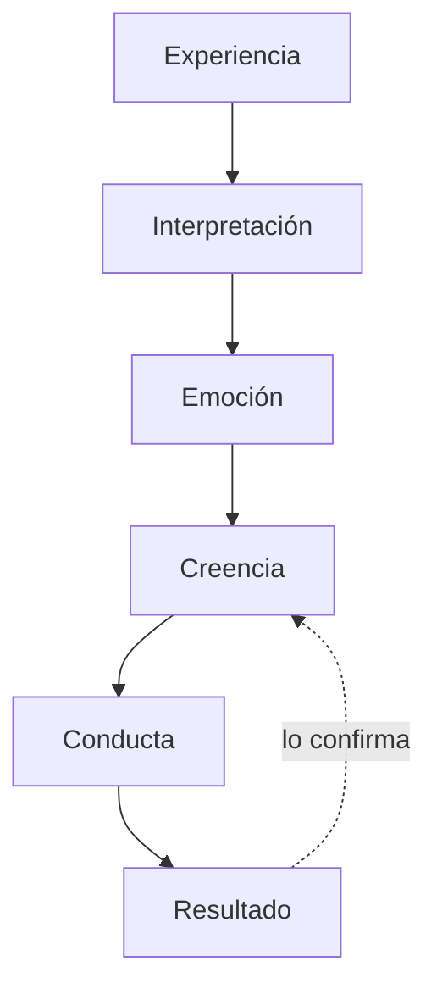

## El circuito

Seis pasos y un bucle. Lo importante es el bucle: **el resultado alimenta de
vuelta la creencia**, así que el sistema se confirma solo y no necesita
evidencia externa.

## Un caso completo

**Experiencia.** Tiene ocho años. Lee en voz alta en clase, se equivoca, los
compañeros se ríen.

**Interpretación.** *«Me equivoqué y me humillaron.»* Podría haber sido *«qué
tontos»* o *«me pasó algo vergonzoso»*. Fue esa.

**Emoción.** Vergüenza. Intensa, física, memorable. Aquí está la grabadora: la
emoción es lo que fija el aprendizaje.

**Creencia.** *«Cuando hablo en público hago el ridículo.»*

**Conducta.** Veinte años evitando exponerse. Y cuando no puede evitarlo, va
tensa, con la voz temblorosa, leyendo el papel.

**Resultado.** Le sale mal.

**El bucle.** *«¿Ves? Ya sabía yo.»* La creencia queda confirmada, y más fuerte
que antes.

Nadie diseñó eso. Se instaló solo, en un minuto, a los ocho años. Y lleva dos
décadas funcionando sin que nadie lo revise.

## Los tres puntos donde parece que se puede intervenir

**En la experiencia.** No se puede: ya pasó. Esto es importante decirlo, porque
mucha gente se queda atascada peleando con lo que ocurrió.

**En el resultado.** Es el punto favorito de la fuerza de voluntad: *«esta vez
lo voy a hacer bien»*. Falla casi siempre, porque estás empujando el final de la
cadena mientras todo lo anterior sigue igual.

**En la interpretación.** Aquí sí. Y es el único sitio donde el cambio se
sostiene.

## Por qué la interpretación

Porque es el punto donde el significado todavía no estaba fijado.

Aquella niña no tenía que concluir que hablar en público la deja en ridículo.
Concluyó eso porque tenía ocho años y ninguna otra explicación disponible. Un
adulto habría tenido veinte explicaciones alternativas — y no habría instalado
nada.

**Cambiar la interpretación no es negar lo que pasó.** Es dejar de tratar la
conclusión de un niño de ocho años como si fuera un dato sobre ti.

## Los dos ingredientes que fijan una creencia

Una sola cosa no basta. Hacen falta dos, y con las dos basta:

**1. Emoción intensa.** Un evento único con carga emocional fuerte instala más
que mil repeticiones tibias. Por eso una humillación de un minuto pesa más que
diez años de elogios.

**2. Repetición.** O bien un evento intenso, o bien muchas repeticiones
pequeñas. *«Eres el desordenado de la casa»*, dicho quinientas veces sin ninguna
intensidad, también instala.

Y hay un tercer atajo: **la autoridad**. Lo que dice alguien que para ti tiene
peso —un padre, un maestro, un médico— entra sin pasar por el filtro. Un niño no
discute a su madre.

## Lo que esto significa para el resto del curso

Si una creencia se instaló con **emoción** y se sostiene por **repetición**,
entonces no se desinstala con argumentos.

Se desinstala con lo mismo con lo que se puso: **una experiencia nueva, con
carga emocional, repetida**.

Eso es exactamente lo que vas a hacer en los módulos siguientes.

> Gran parte de nuestras creencias, hábitos y respuestas automáticas se
> desarrollan a través de experiencias repetidas. Y lo que se aprendió, se puede
> volver a aprender.
