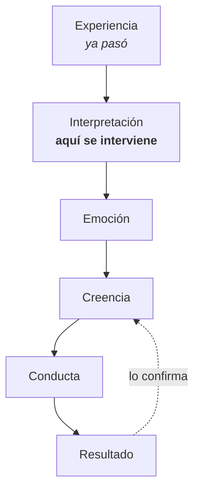

## El circuito

| Punto | ¿Se puede tocar? | Por qué |
|---|---|---|
| Experiencia | ❌ | Ya pasó |
| **Interpretación** | ✅ | Es donde el significado se fijó, y el significado se puede revisar |
| Emoción | Indirecto | Cambia cuando cambia la interpretación |
| Creencia | Indirecto | Se cae sola cuando su base se mueve |
| Conducta | Parcial | Se puede forzar un rato; vuelve sin lo anterior |
| Resultado | ❌ | Es la consecuencia, no la causa |

## Los dos ingredientes

Una creencia se fija con **emoción intensa** o con **repetición** — o con las
dos. Y hay un atajo: la **autoridad** (lo que dice alguien con peso para ti entra
sin filtro).

**Consecuencia práctica:** si se instaló con emoción, no se quita con
argumentos. Se quita con **experiencia nueva, con emoción, repetida**.

## Tu circuito

Elige una creencia que reconozcas como limitante:

| Paso | Tu respuesta |
|---|---|
| **Experiencia** — ¿cuándo la sentí por primera vez? | |
| **Interpretación** — ¿qué me dije de mí en ese momento? | |
| **Emoción** — ¿qué sentí? | |
| **Creencia** — ¿en qué frase se convirtió? | |
| **Conducta** — ¿qué hago hoy por causa de eso? | |
| **Resultado** — ¿qué obtengo, y cómo confirma la creencia? | |

## La pregunta clave

Mira la casilla de **interpretación** y pregúntate:

> ¿Qué edad tenía quien sacó esa conclusión?

Casi siempre la respuesta es «pocos años». Y eso lo cambia todo: no estás
discutiendo con un dato sobre ti, estás revisando **la conclusión de un niño que
no tenía otra explicación disponible**.

## Otras interpretaciones posibles

Vuelve a la experiencia y escribe **tres interpretaciones distintas** que un
adulto podría haber hecho de lo mismo:

1. …
2. …
3. …

No tienes que creértelas todavía. Solo comprobar que existían.

## Para la semana

Cada vez que aparezca la conducta del circuito, anota una línea: qué pasó justo
antes. Vas a empezar a ver el disparador.
