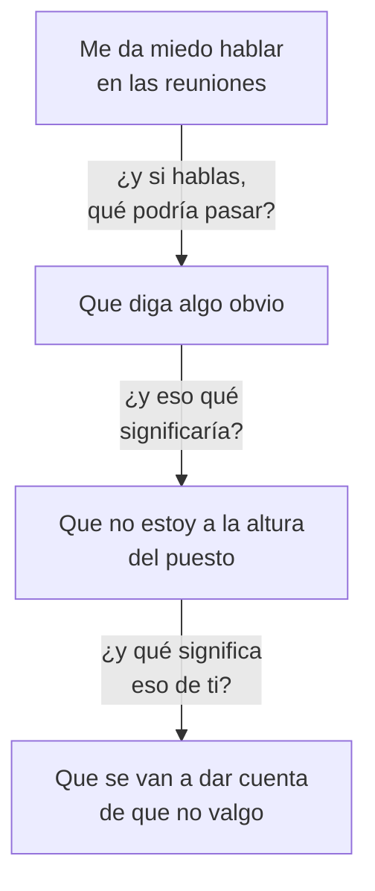

## Las cinco huellas

| # | Huella | Dónde mirar | La pregunta |
|---|---|---|---|
| 1 | **Lenguaje** | «Es que yo soy…», «siempre», «tengo que», «no puedo» | ¿Qué doy por hecho al decir esto? |
| 2 | **Techo** | Donde haces todo bien y no pasa nada | ¿Qué se repite con gente distinta? |
| 3 | **Reacción desmedida** | Algo pequeño te arruina el día | ¿Qué significó, más allá de lo que pasó? |
| 4 | **Envidia** | Quien te molesta sin haberte hecho nada | ¿Qué se permite que yo no me permito? |
| 5 | **Evitación** | Lo que pospones sin razón práctica | ¿Qué predigo que pasaría si lo hago? |

## La escalera

De la molestia difusa a la frase exacta, preguntando **«¿y eso qué
significa?»**:

## Sabes que llegaste cuando…

- ☐ La frase empieza por **«soy»** o **«no soy»**
- ☐ La respuesta es **«no sé, simplemente es así»**
- ☐ **El cuerpo reacciona** al decirla en voz alta

La tercera es la más fiable. **La frase correcta se nota.**

## Tu rastreo

| Huella | Lo que encuentro en mí |
|---|---|
| Lenguaje: mis tres frases hechas | |
| Techo: dónde se repite el patrón | |
| Reacción desmedida: la última vez | |
| Envidia: a quién y por qué | |
| Evitación: qué llevo posponiendo | |

## Baja tu escalera

Elige una de las cinco y baja:

| Nivel | Lo que aparece |
|---|---|
| Lo que noto | |
| ¿Y eso qué significa? | |
| ¿Y eso qué significa? | |
| ¿Y eso qué significa? | |
| **La frase** | |

## Regla de uso

Encuentra **una**. Trabájala. Después busca la siguiente.

Coleccionar creencias limitantes sin trabajar ninguna es una forma elegante de
no cambiar nada.

## Y una precaución

Si al bajar aparece algo que te desborda, para. Eso se trabaja acompañada.
