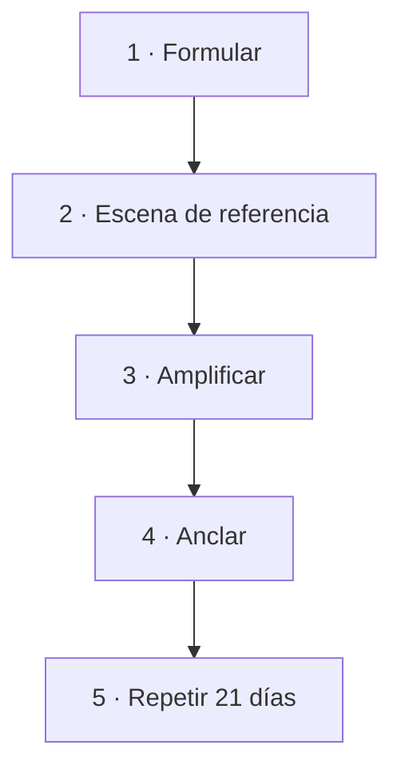

## Los cuatro pasos

Instalar una creencia no es repetir una frase. Son cuatro cosas, y las cuatro
hacen falta:

---

## 1 · Formular

Ya conoces las tres condiciones del módulo 4: **creíble hoy**, **en proceso**,
**sobre lo que haces**.

Añade una cuarta para esta fase: **corta**. Si no cabe en una respiración, no
sirve para lo que viene.

| Demasiado larga | Lista para instalar |
|---|---|
| «Estoy aprendiendo poco a poco a confiar en que mi trabajo tiene valor y a cobrarlo» | «Mi trabajo vale lo que cobro» |
| «Voy entendiendo que puedo poner límites sin que la gente se aleje de mí» | «Puedo decir que no» |

## 2 · La escena de referencia

Aquí está la diferencia entre esto y una afirmación vacía.

Una frase sola no tiene carga emocional. **Un recuerdo sí.**

Busca en tu vida **un momento real** en que esa frase nueva fue verdad. Aunque
fuera pequeño. Aunque fuera hace años. Aunque durara diez minutos.

- «Puedo decir que no» → aquella vez que dijiste que no y el mundo siguió.
- «Mi trabajo vale lo que cobro» → aquel cliente que pagó sin regatear y te dio
  las gracias.
- «Puedo hablar en público» → aquella vez que te salió bien, aunque fuera ante
  cinco personas.

**Si no encuentras ninguno**, sirve uno imaginado con mucho detalle: el
inconsciente responde igual a una experiencia interna suficientemente vívida.
Pero busca primero uno real — pesa más.

## 3 · Amplificar

Métete **dentro** de la escena. No la mires desde fuera como una película tuya:
mira con tus ojos.

Y sube el volumen de todo:

- **Qué ves** — colores, luz, quién está.
- **Qué oyes** — voces, tono, lo que se dijo.
- **Qué sientes** — dónde en el cuerpo, con qué temperatura, con qué peso.

Cuando la sensación esté en su punto más alto, **ahí** dices la frase.

Ese orden importa: primero el estado, después la frase. Al revés no instala
nada.

## 4 · Anclar

En el momento de máxima intensidad, haz un **gesto pequeño y poco habitual**:
unir pulgar e índice de la mano derecha, presionar el nudillo, apretar la
muñeca.

Tiene que ser un gesto que no hagas por casualidad durante el día — si no, se
descarga solo.

Después, ese gesto te devuelve el estado. No mágicamente: como una canción te
devuelve un momento de tu vida.

*(El curso de Emociones y anclajes trabaja esto a fondo.)*

---

## El protocolo de refuerzo

**Días 1 a 7 · una vez al día, 5 minutos.**
Escena completa: métete, amplifica, di la frase, ancla.

**Días 8 a 21 · una vez al día, 2 minutos.**
Ya no hace falta la escena entera: basta el gesto y la frase.

**Los dos momentos:** al despertar y antes de dormir. Son las ventanas de mayor
receptividad — Theta natural, como viste en Hipnosis.

**Además, durante el día:** cada vez que aparezca la situación real donde la
creencia vieja solía activarse, usa el gesto **ahí**. Eso es lo que traslada el
trabajo del cuaderno a la vida.

---

## Qué esperar

| Días | Qué pasa |
|---|---|
| 1–3 | Se siente falso. **Le pasa a todo el mundo.** No es señal de nada |
| 4–7 | La escena llega más rápido. El cuerpo reconoce el camino |
| 8–14 | Aparece una reacción distinta en una situación real. Pequeña, pero distinta |
| 15–21 | La frase aparece sola antes de que la llames |

**El punto de abandono está entre el día 2 y el 4.** Ahí es cuando la sensación
de estar haciendo algo ridículo es más fuerte y todavía no hay ningún resultado
que la compense.

Si lo sabes de antemano, lo atraviesas.

## La regla

> **Nunca dos días seguidos.**

Y no reinicies la cuenta al fallar un día. Ese «perdí un día, empiezo el lunes»
arruina más procesos que la desgana.

## Y algo que conviene decir

Esto no borra la creencia vieja. Las creencias no se borran: se **superponen**.

Va a seguir apareciendo, sobre todo bajo estrés. Lo que cambia es que ya no es
la única voz, y que tienes otra a la que recurrir.

Eso, sostenido, es todo lo que hace falta.
