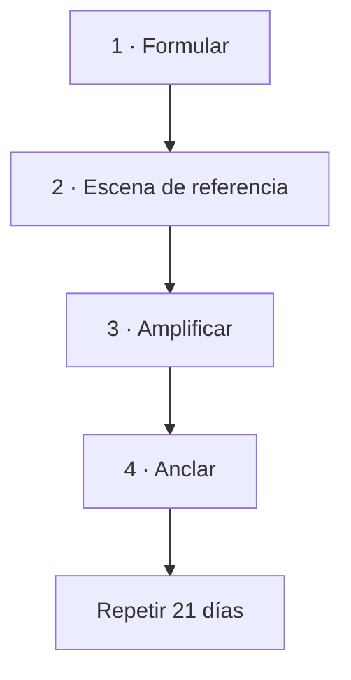

## Los cuatro pasos

| Paso | Qué hacer | Clave |
|---|---|---|
| **Formular** | La frase nueva | Creíble, en proceso, sobre lo que haces, **corta** |
| **Escena** | Un recuerdo real donde esa frase fue verdad | Aunque fuera pequeño |
| **Amplificar** | Meterte dentro: ver, oír, sentir | Primero el estado, **después** la frase |
| **Anclar** | Un gesto pequeño y poco habitual | Que no lo hagas por casualidad |

## Tu instalación

| | Tu respuesta |
|---|---|
| **La frase** (que quepa en una respiración) | |
| **La escena**: ¿cuándo fue verdad? | |
| ¿Qué veías? | |
| ¿Qué oías? | |
| ¿Qué sentías, y dónde en el cuerpo? | |
| **El gesto de anclaje** | |

## El calendario

| Días | Qué | Cuánto |
|---|---|---|
| 1–7 | Escena completa: entrar, amplificar, frase, ancla | 5 min |
| 8–21 | Solo gesto + frase | 2 min |
| Todo el mes | El gesto **en la situación real** donde aparecía la creencia vieja | — |

Los dos momentos: **al despertar y antes de dormir**.

## Qué esperar

| Días | Qué pasa |
|---|---|
| 1–3 | Se siente falso. **Le pasa a todo el mundo** |
| 4–7 | La escena llega más rápido |
| 8–14 | Una reacción distinta en una situación real |
| 15–21 | La frase aparece sola antes de llamarla |

⚠️ **El punto de abandono está entre el día 2 y el 4.** Ahí la sensación de
ridículo es máxima y todavía no hay resultado que la compense. Sabiéndolo, se
atraviesa.

## Registro

| Día | ✓ | ¿Usé el gesto en una situación real? | Qué noté |
|---|---|---|---|
| 1 | ☐ | | |
| 2 | ☐ | | |
| 3 | ☐ | | |
| … | ☐ | | |
| 21 | ☐ | | |

**Nunca dos días seguidos.** Y al fallar uno, se retoma donde se quedó — no se
reinicia la cuenta.

## Lo que no va a pasar

La creencia vieja **no se borra**. Va a seguir apareciendo, sobre todo bajo
estrés.

Lo que cambia es que deja de ser la única voz. Y eso, sostenido, es suficiente.

## Al terminar los 21 días

| Pregunta | Tu respuesta |
|---|---|
| ¿Qué cambió en mi forma de reaccionar? | |
| ¿Dónde apareció la frase nueva sola? | |
| ¿Qué me dijo alguien cercano sobre mí estas semanas? | |
| ¿Cuál es la siguiente creencia que voy a trabajar? | |
