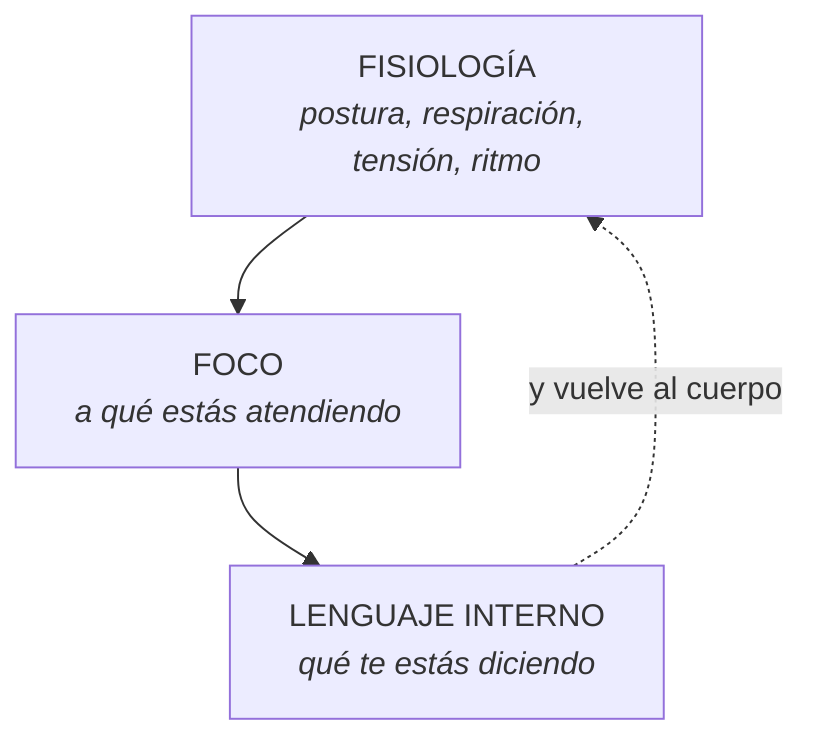
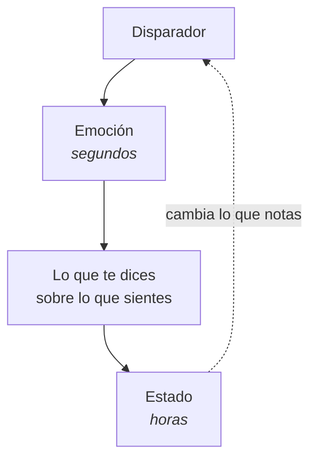

## Las tres piezas

Un estado es la suma de tres cosas que ocurren a la vez y se sostienen entre sí:

Ninguna manda sobre las otras dos. Cambia una y las otras dos se mueven — y ahí
está toda la palanca del curso.

La diferencia práctica es de **velocidad**: el foco es difícil de mover a
voluntad, el lenguaje interno es lento, y el cuerpo responde en segundos. Por eso
se entra siempre por el cuerpo.

---

## Emoción, sentimiento, estado

Se usan como sinónimos y no lo son. La distinción viene de Damasio y sirve:

| | Qué es | Cuánto dura |
|---|---|---|
| **Emoción** | La respuesta corporal automática | Segundos |
| **Sentimiento** | Darte cuenta de esa respuesta y nombrarla | Minutos |
| **Estado** | El paquete completo instalado: cuerpo, foco y lenguaje | Horas o días |

Un enfado es una emoción. Estar «de mal humor toda la tarde» ya es un estado —
la emoción duró unos segundos y lo que la mantiene viva es lo que estás haciendo
con el cuerpo, el foco y lo que te dices desde entonces.

**Eso es una buena noticia.** La emoción no se elige. El estado se sostiene, y
lo que se sostiene se puede soltar.

---

## El disparador

Un estado no aparece porque sí. Lo enciende algo — y casi nunca es lo que uno
cree.

| Tipo | Ejemplo |
|---|---|
| **Externo** | Un tono de voz, una canción, un olor, un mensaje |
| **Interno** | Un recuerdo, una imagen mental, una frase que te dices |
| **Corporal** | Hambre, mal dormir, cafeína, dolor, encierro |

La tercera columna es la que más se ignora y la que más pesa. Una discusión a
las once de la noche con cuatro horas de sueño no es la misma discusión.

**Regla útil:** antes de interpretar un estado, revisa lo básico. Comer, dormir,
moverse, salir. Muchas «crisis existenciales» son hambre y siete horas sentado.

---

## La cadena completa

El bucle del final es lo importante: un estado instalado **te cambia lo que
percibes**, así que empieza a encontrar disparadores por todas partes. Por eso
un mal día se hace bola sin que pase nada nuevo.

---

## Lo que este curso no dice

No dice que haya que estar siempre bien. La tristeza, el enfado y el miedo
tienen función: informan, protegen, señalan un límite pisado.

El trabajo no es eliminarlos. Es dejar de quedarse **atrapada** en ellos cuando
ya cumplieron su función, y poder acceder a otro estado cuando la situación lo
pide.

> Una emoción que dura tres días no está protegiendo nada. Está instalada.

---

## Estado de recurso

El nombre que la PNL le da al objetivo del curso: un estado en el que tienes
acceso a lo que sabes hacer.

Los tres que más se piden, y los que se van a trabajar:

- **Calma** — cuando la activación tapa el criterio.
- **Confianza** — cuando lo sabes hacer y no te sale.
- **Seguridad** — cuando hay que sostener un límite.

No son estados que se tengan o no se tengan. Son estados a los que se entra —
y se entra más rápido si has ensayado el camino.
