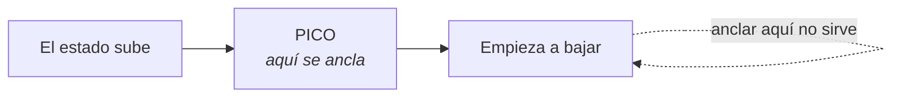

## Qué es un ancla

Un estímulo que dispara un estado. Nada más.

Un olor que te lleva a la cocina de tu abuela. Una canción que te devuelve un
verano. El tono de voz de alguien que te pone en guardia antes de entender la
frase. Todos son anclas, y ninguno se instaló a propósito.

El mecanismo es viejo y conocido: **asociación**. Algo estuvo presente mientras
ocurría un estado intenso, y quedó pegado. Es lo mismo que describió Pavlov, sin
la parte del laboratorio.

Anclar a propósito es usar ese mecanismo para tener acceso a un estado que
quieres, cuando lo quieres.

---

## Las cuatro condiciones

Casi todos los anclajes que la gente intenta fallan. Y siempre fallan por lo
mismo: se saltó una de estas cuatro.

### 1 · Intensidad

El estado tiene que estar **alto** en el momento de anclar. No «recordar que una
vez estuviste tranquila»: estar tranquila ahora, sintiéndolo en el cuerpo.

Un estado tibio no ancla. Es la condición que más se incumple.

### 2 · Momento exacto

Se ancla en el **pico**, no después.

El estado sube, llega a su punto más alto y empieza a bajar. La ventana buena
está justo antes del pico y termina en él. Anclar cuando ya está bajando pega el
gesto a la bajada, no al estado.

### 3 · Estímulo único

El gesto tiene que ser algo que **no hagas por casualidad**.

Apretar el puño no sirve: aprietas el puño treinta veces al día por otros
motivos, y cada una de esas veces desgasta el ancla.

Sirve: presionar el nudillo del índice con el pulgar, juntar dos dedos concretos,
apretar un punto de la muñeca. Algo específico y raro.

### 4 · Repetición

Una vez no basta. **Cinco a siete repeticiones** con el mismo gesto, en el mismo
punto exacto, con la misma presión.

«El mismo punto» es literal: si un día aprietas el nudillo y otro día la falange,
son dos anclas a medias en vez de una entera.

---

## Los tres canales

| Canal | Qué es | Ventaja | Inconveniente |
|---|---|---|---|
| **Gesto** (kinestésico) | Una presión concreta | Discreto, siempre lo llevas | Hay que ser exacta |
| **Palabra** (auditivo) | Una palabra dicha por dentro | Se usa hablando | Se desgasta si es común |
| **Imagen** (visual) | Una imagen mental fija | Muy potente | Necesita un segundo de calma |

El **gesto** es el recomendado para empezar: funciona en una reunión, en una
discusión y en la sala de espera de un hospital sin que nadie lo vea.

Lo más sólido es **combinar dos**: el gesto y la palabra a la vez. Se refuerzan.

---

## El protocolo, en corto

1. **Elige el estado** — uno solo, concreto.
2. **Elige el gesto** — específico, que no hagas por casualidad.
3. **Entra al estado** de verdad: recuerdo real, revivido con los tres canales.
4. **Ancla en el pico** — el gesto, tres a cinco segundos.
5. **Rompe el estado** — mira alrededor, cuenta al revés, muévete.
6. **Repite** cinco a siete veces.
7. **Prueba en frío** — más tarde, sin preparación: haz el gesto y observa.

El paso 5 parece prescindible y no lo es. Sin romper, la segunda repetición
ancla los restos de la primera y el ancla queda blanda.

El paso 7 es la única verificación real. Si al hacer el gesto en frío no aparece
nada, algo de las cuatro condiciones falló — casi siempre la intensidad.

---

## Tus anclas actuales

Ya tienes decenas. Algunas te sirven y otras no:

| Ancla | Estado que dispara |
|---|---|
| El tono de voz de alguien | Alerta, defensa |
| Un lugar concreto de la casa | Cansancio, encierro |
| Una notificación | Urgencia |
| Una canción | Nostalgia, alegría |
| Un olor | Calma, o justo lo contrario |

Detectar las que juegan en tu contra vale tanto como instalar una nueva. A veces
la intervención más rápida no es anclar nada: es dejar de trabajar en el sitio
donde te sientes atrapada.

---

## Lo que un ancla no hace

- **No borra la emoción.** Da acceso a otro estado, no elimina el que había.
- **No dura para siempre sin uso.** Se desgasta; se refuerza usándola en
  situaciones donde el estado ya está presente.
- **No sustituye lo básico.** Con tres horas de sueño no hay ancla que funcione.
- **No es un truco de fuerza.** Si la situación pide otra cosa —salir, pedir
  ayuda, poner un límite— el ancla no la reemplaza.

> El ancla no te quita el miedo. Te da la calma suficiente para decidir con
> miedo.
