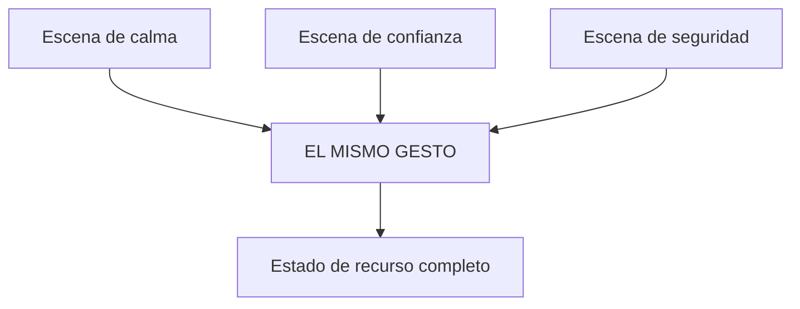

## Cuál necesitas de verdad

Los tres se confunden. La diferencia práctica:

| Recurso | Para qué sirve | La señal de que es el tuyo |
|---|---|---|
| **Calma** | Cuando la activación tapa el criterio | «Me bloqueo», «se me va la cabeza», «reacciono y luego me arrepiento» |
| **Confianza** | Cuando sabes hacerlo y no te sale | «En mi cabeza lo tengo, pero al hablar se me cae» |
| **Seguridad** | Cuando hay que sostener algo | «Digo que sí y luego me arrepiento», «me cuesta mantener un límite» |

**Regla:** el que te cueste más encontrar en tu propia historia suele ser el que
más falta te hace. No lo evites por eso.

---

## La escena de referencia

Un ancla necesita un **recuerdo real**. No una escena imaginada, no un
propósito, no una versión mejorada de ti misma.

Y aquí aparece la objeción de siempre: *«es que yo nunca me he sentido segura»*.

Casi siempre es falsa, y por una razón concreta: la memoria de un estado se
archiva junto al estado. Cuando buscas un recuerdo de seguridad desde la
inseguridad, no lo encuentras — no porque no exista, sino porque estás buscando
desde el archivo equivocado.

**Tres formas de encontrarlo igual:**

### 1 · Bajar el listón

No buscas el día más seguro de tu vida. Buscas **treinta segundos**.

Un «no» que dijiste. Una vez que defendiste a alguien. El momento en que te
mantuviste en algo aunque te insistieran. Un trámite que resolviste sola.

Sirve un recuerdo pequeño e intenso mucho más que uno grande y borroso.

### 2 · Cambiar de área

Quien no encuentra confianza en el trabajo la encuentra cocinando, conduciendo,
con un idioma, con un animal, jugando a algo.

El estado es el mismo: lo que cambia es el contexto donde se dio.

### 3 · Prestada, con cuidado

Si de verdad no aparece nada propio, se puede trabajar con un **modelo**: alguien
a quien viste sostener eso. Se entra por cómo estaba su cuerpo, no por admiración.

Es la opción más débil de las tres y funciona a medias. Úsala solo si las otras
dos fallaron, y sustitúyela por una escena propia en cuanto la vida te dé una.

---

## Cómo se revive una escena

Escribirla no basta. Hay que **volver a entrar**, y en este orden:

1. **Visual** — ¿dónde estabas? ¿qué había alrededor? ¿había luz?
2. **Auditivo** — ¿qué se oía? ¿alguien habló? ¿qué te dijiste?
3. **Kinestésico** — ¿cómo estaba el cuerpo? ¿dónde se sentía? ¿pesado, ligero,
   caliente?
4. **Ajustar** — sube el brillo, sube el volumen, hazla más grande y más cerca.

El paso 4 es la parte técnica: la intensidad de un recuerdo depende de sus
**submodalidades** —tamaño, brillo, distancia, volumen— y se pueden mover a
propósito. Una imagen más grande, más brillante y más cercana intensifica; una
pequeña, gris y lejana, apaga.

Ahí, en lo alto: el gesto.

---

## Apilar recursos

Un mismo gesto puede llevar varios estados. Se llama **apilado** y es lo que
convierte un ancla en algo robusto.

Cómo se hace:

1. Instala el primer recurso completo: escena, pico, gesto, romper, 5-7 veces.
2. **Rompe el estado** del todo. Levántate, camina.
3. Instala el segundo con **el mismo gesto**, misma presión, mismo punto.
4. Rompe otra vez.
5. Instala el tercero igual.
6. Prueba en frío al día siguiente.

**Máximo tres.** Con más, el ancla se vuelve difusa y ya no dispara nada
reconocible.

---

## El plan de despliegue

Un ancla instalada y no usada se apaga. Antes de terminar el módulo hay que
decidir **dónde** se va a usar.

| Situación concreta | ¿Cuándo la hago? | ¿Antes, durante o después? |
|---|---|---|
| | | |

Lo importante es que sea **concreta**. «Cuando me ponga nerviosa» no es una
situación: es un estado. «El martes en la reunión de las diez, mientras espero mi
turno» sí lo es.

Y la regla de refuerzo: **úsala también cuando el estado ya está presente**. Cada
vez que estás en calma y haces el gesto, el ancla se hace más fuerte. Solo usarla
en emergencias la desgasta.

---

## Cuándo no basta un ancla

Si lo que hay debajo es una creencia («no valgo»), el ancla ayuda en el momento y
no cambia el fondo. Ahí el trabajo es el curso de **Creencias limitantes**.

Si lo que hay es ansiedad sostenida o un disparador traumático, el ancla no es la
herramienta y el módulo 6 lo explica.

> El ancla es un puente para cruzar. No es la otra orilla.
