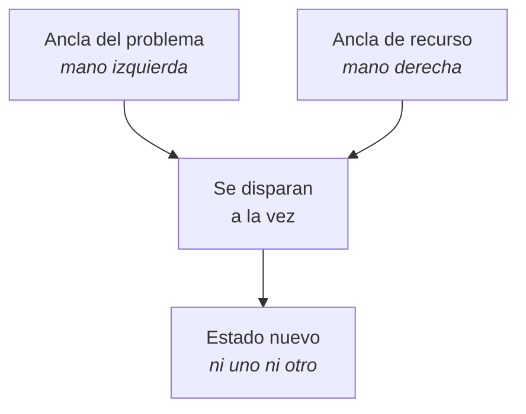

## Qué es un colapso de anclas

Dos anclas disparadas **a la vez**: una con el estado problema y otra con un
estado de recurso.

El sistema nervioso no puede sostener los dos a la vez. Lo que ocurre es una
mezcla —momento de confusión, respiración irregular, cara que cambia— y de ahí
sale un tercer estado, distinto de los dos anteriores.

Después, el disparador original ya no dispara limpio. No desaparece: pierde
fuerza.

---

## La regla que decide el resultado

**El recurso tiene que ser más fuerte que el problema.**

Si el problema pesa 8 y el recurso 5, no se colapsa nada: el problema se lleva
por delante al recurso y la sesión termina reforzándolo.

Por eso se apilan **dos o tres recursos** contra un solo problema, y por eso el
problema que se elige debe ser **de intensidad media**: un 5 o un 6, no el peor
recuerdo de tu vida.

---

## Los siete pasos

1. **Elige el problema.** Concreto y de intensidad media. «Cuando me hablan en
   ese tono», no «mi infancia».

2. **Instala el recurso** en una mano —por ejemplo, presión en el nudillo
   izquierdo— apilando **dos o tres** estados. Cinco a siete repeticiones cada
   uno, rompiendo entre medias.

3. **Prueba el recurso en frío.** Si no dispara claro, **no sigas**. Este es el
   punto donde hay que parar y volver atrás; casi todos los colapsos fallidos
   se saltaron esta comprobación.

4. **Instala el problema** en la otra mano. Se entra al recuerdo lo justo para
   que aparezca —no se revuelca uno dentro— y se ancla. Una o dos repeticiones
   bastan.

5. **Dispara las dos a la vez.** Mantén entre quince y treinta segundos. Vas a
   notar confusión, la respiración cambia, la cara se mueve. Es lo esperado.

6. **Suelta primero la del problema**, y sostén la del recurso cinco segundos
   más. El orden importa: lo último que queda activo es lo que se lleva.

7. **Prueba.** Piensa en la situación original. Debería sentirse **distinta**,
   más lejos, más neutra. Si sigue igual, el recurso no era suficiente: se
   refuerza y se repite otro día, no en la misma sesión.

---

## El círculo de excelencia

La misma lógica, pero el ancla no es un gesto: es **un sitio en el suelo**.

1. Dibuja mentalmente un círculo en el suelo, delante de ti. Ponle color si
   ayuda.
2. **Fuera del círculo**, recuerda un momento en el que estuviste en tu mejor
   estado.
3. Cuando el estado sube, **entra al círculo** caminando.
4. Dentro, amplifica: postura de ese momento, respiración de ese momento, la
   frase de ese momento.
5. En el pico, **sal del círculo** y rompe el estado.
6. Repite tres a cinco veces, con otros recuerdos si los tienes.
7. **Prueba**: entra al círculo sin preparar nada. El estado debería aparecer.
8. Para llevártelo: imagina el círculo en el sitio donde lo vas a necesitar —la
   puerta de la oficina, el escenario, la sala— y entra ahí mentalmente antes de
   entrar de verdad.

Funciona bien para actuaciones concretas: hablar en público, una entrevista, una
competición. Menos bien para estados difusos.

**Ventaja sobre el gesto:** el cuerpo entero participa, y eso lo hace más
intenso. **Inconveniente:** necesitas espacio y un momento a solas, así que no
sirve en mitad de una reunión.

---

## Cuándo NO se hace nada de esto

Esta parte no es de trámite.

- **Con un recuerdo traumático.** Un colapso casero sobre un trauma puede
  reactivarlo sin nadie que sostenga lo que sale. Eso es trabajo clínico:
  EMDR, terapia de trauma, un profesional.
- **En crisis actual.** Duelo reciente, ruptura de esta semana, despido de ayer.
  Primero se atraviesa.
- **Si el recurso no dispara claro** en la prueba del paso 3.
- **Sola, la primera vez,** si el tema es grande. Mejor con alguien de
  confianza delante, aunque no sepa la técnica.

Y una señal para parar en mitad de la sesión: si aparece llanto que no cede,
desconexión, sensación de irrealidad o el cuerpo se bloquea. Ahí se suelta todo,
se abren los ojos, se mira alrededor, se nombran cinco cosas de la habitación y
se deja para otro día.

> La técnica no es la parte difícil. La parte difícil es saber cuándo no
> usarla.
