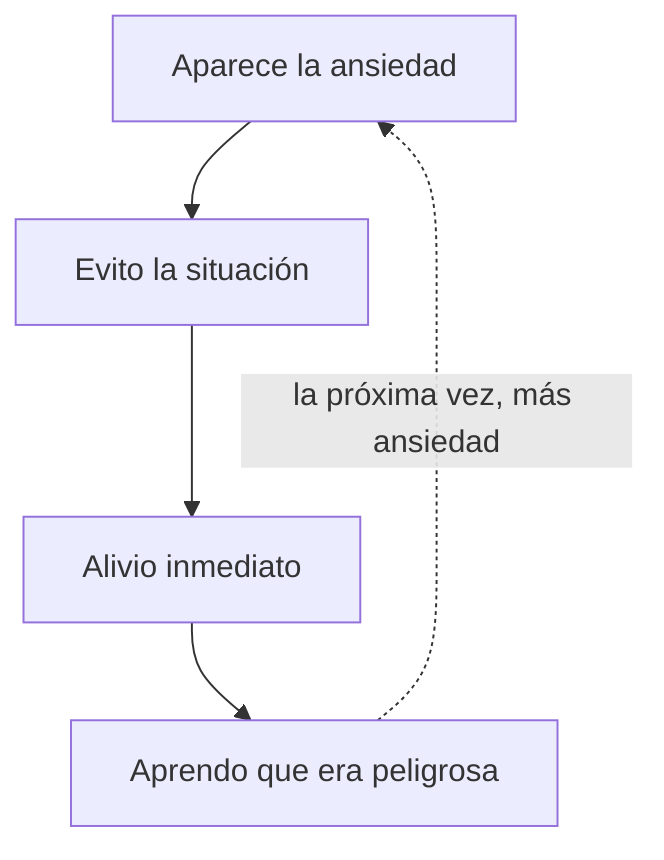

## Tres cosas distintas

| | Qué es | Tiene objeto | Qué pide |
|---|---|---|---|
| **Miedo** | Respuesta a una amenaza presente | Sí | Actuar o retirarse |
| **Ansiedad** | Anticipación de una amenaza futura | No, o difuso | Tolerar la incertidumbre |
| **Pánico** | Descarga aguda, minutos, con síntomas físicos intensos | No | Esperar sin luchar |

Confundirlos es lo que hace que las técnicas fallen. A un miedo concreto se le
responde con preparación. A la ansiedad, no: no hay nada que preparar, porque el
objeto no existe todavía.

Y en un ataque de pánico lo que funciona es casi lo contrario de lo que uno
quiere hacer: **no luchar**. El pico dura unos minutos y baja solo. Pelear con
él lo alarga.

---

## Lo que sí ayuda

### 1 · El ancla de recurso, con expectativa correcta

No quita el miedo. Da acceso a un poco de calma, y con un poco de calma se puede
decidir. Se usa **antes** —en la sala de espera, en el coche— más que durante.

### 2 · La respiración, con una advertencia

La exhalación larga funciona para activación general. En **pánico**, a algunas
personas les empeora: atender al aire es justo lo que dispara el miedo a
ahogarse. Si es tu caso, salta a la herramienta siguiente.

### 3 · Atención externa

Cuando la atención está dentro —vigilando el pecho, contando latidos— la
ansiedad se alimenta. Sacarla fuera la corta:

> **5-4-3-2-1:** cinco cosas que ves · cuatro que oyes · tres que tocas · dos
> que hueles · una que saboreas.

Es lo más útil que hay para el momento agudo, y funciona precisamente porque no
tiene nada que ver con la emoción.

### 4 · Exposición gradual

La herramienta con más evidencia de todas, y la única que cambia el fondo y no
solo el momento.

La ansiedad se sostiene por **evitación**: cada vez que evitas, confirmas que
era peligroso. La exposición rompe ese bucle.

Se hace por escalones, de menos a más, y con una regla: **no se sale de la
situación mientras la ansiedad está en el pico**. Se espera a que baja aunque
sea un poco, y entonces se sale. Salir en el pico enseña justo lo contrario.

### 5 · Nombrar

Poner nombre a la emoción baja su intensidad — es el *affect labeling* del curso
de lenguaje. «Estoy notando ansiedad» funciona mejor que «estoy fatal».

### 6 · Lo básico

Sueño, cafeína, alcohol y movimiento. La cafeína en particular produce
exactamente los síntomas físicos de la ansiedad, y mucha gente lleva años
atribuyéndolos a otra cosa.

---

## Lo que no ayuda

| Parece que ayuda | Por qué no |
|---|---|
| **Evitar la situación** | Alivia hoy y la refuerza para siempre |
| **«Tranquilízate»** | Ordenarse calma añade frustración a la ansiedad |
| **Buscar la causa en plena crisis** | El análisis en caliente es rumiación con otro nombre |
| **Distraerse siempre** | En dosis pequeñas ayuda; como estrategia única, es evitación |
| **Buscar información sin parar** | Comprobar síntomas en internet es un ritual de ansiedad |
| **Pedir que te tranquilicen una y otra vez** | El alivio dura minutos y la necesidad crece |
| **Respiración forzada y profunda** | Hiperventilar sube la activación |

---

## El bucle

El alivio del paso 3 es real, y por eso el bucle se sostiene solo. Romperlo
duele un poco cada vez y funciona.

---

## Cuándo dejar de hacer esto sola

Criterios concretos, no vaguedades. **Busca un profesional si:**

- Ha durado **más de seis meses** de forma sostenida.
- Te impide trabajar, estudiar, salir o mantener relaciones.
- Hay **ataques de pánico repetidos**.
- Estás evitando cada vez más cosas.
- Hay síntomas físicos sin causa médica que ya se descartó.
- Duermes mal de forma sostenida.
- Estás usando alcohol o sustancias para calmarlo.
- Hay pensamientos de hacerte daño. **Aquí no hay matices: ayuda hoy.**

**Qué funciona, con evidencia:** terapia cognitivo-conductual —sobre todo con
exposición—, ACT, y en algunos casos medicación. Nada de eso compite con este
curso: son cosas distintas.

> Pedir ayuda no es abandonar el trabajo personal. Es la parte del trabajo
> personal que más cuesta hacer.

---

## Cómo encaja este curso

Lo que aquí se enseña sirve para **ansiedad cotidiana**: nervios antes de algo,
activación alta, un miedo concreto y proporcionado.

Para un trastorno de ansiedad, estas herramientas son un apoyo mientras alguien
con formación trata el fondo. Y dicho así, sin adornos, es más útil que
prometer de más.
