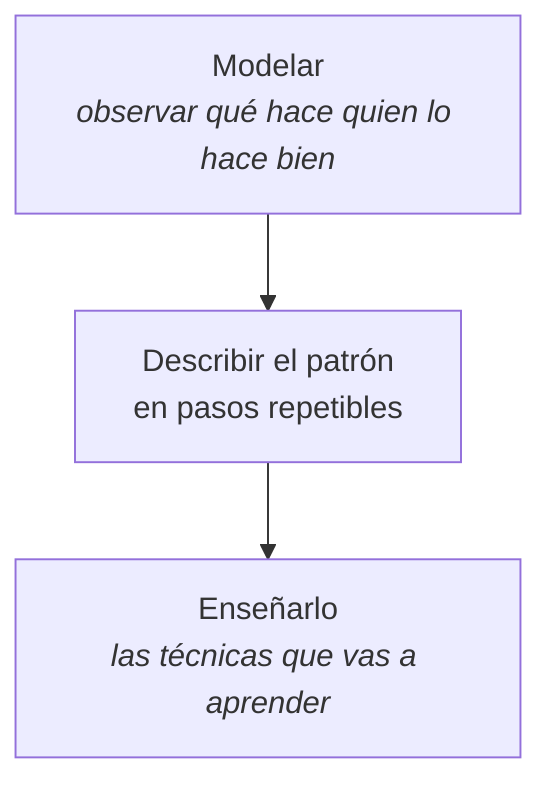

## Las tres palabras

| Palabra | Qué señala | Dónde se trabaja en el catálogo |
|---|---|---|
| **Programación** | Patrones que se repiten | Creencias limitantes |
| **Neuro** | El cuerpo sostiene el patrón | Emociones y anclajes |
| **Lingüística** | El lenguaje lo construye y lo cambia | El poder del lenguaje |

## Mitos y realidades

| Se dice | Lo cierto |
|---|---|
| «Está toda demostrada» | Algunas herramientas sí; varias afirmaciones históricas, no |
| «Es pensamiento positivo» | Trabaja la estructura de la experiencia, no la repetición de frases |
| «Sirve para controlar a otros» | Se puede influir; imponer contra los valores de alguien, no |
| «Funciona en un fin de semana» | Un patrón de años necesita práctica sostenida |

## El mapa del método

## Tu punto de partida

Antes de seguir, ubícate:

| Pregunta | Tu respuesta |
|---|---|
| ¿Qué me trajo a este curso? | |
| ¿Qué patrón mío se repite y me gustaría entender? | |
| ¿Qué espero de la PNL — y qué he escuchado que quizá no sea cierto? | |

## Los cuatro cursos que vienen después

Este es el de fundamentos. Con la base puesta, el catálogo se abre así:

- **El poder del lenguaje** — si lo tuyo es comunicar mejor y discutir menos.
- **Creencias limitantes** — si hay un techo que se repite.
- **Emociones y anclajes** — si el problema es el estado, no la información.
- **Hipnosis y PNL** — si quieres trabajar directamente con el inconsciente.
- **Niveles de Conciencia** — si lo que buscas es entender desde dónde decides.

No hay orden obligatorio después de este. Elige por lo que te esté doliendo.
