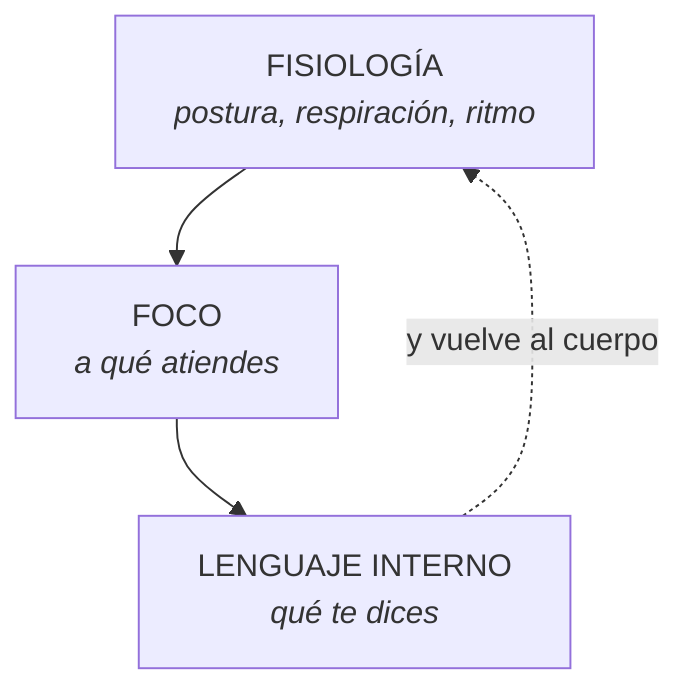

## Qué es un estado

La suma de todo lo que está pasando en ti en un momento dado: lo que piensas, lo
que sientes, cómo respiras, cómo está tu postura, qué te estás diciendo por
dentro.

No es «estar de buen o mal humor». Es más concreto y más útil que eso.

Un estado tiene **tres componentes**, y los tres se sostienen entre sí:

Si cambias uno, los otros dos se mueven. Esa es toda la palanca.

## Por qué el cuerpo va primero

Porque es el único de los tres que puedes cambiar **a voluntad y de inmediato**.

Intenta ahora mismo dejar de pensar en algo que te preocupa. No se puede — o
cuesta mucho. Ahora enderézate, baja los hombros y haz tres exhalaciones largas.
Eso sí se puede, tarda quince segundos, y el pensamiento cambia detrás.

La ruta es la misma que verás en el curso de Hipnosis con la respiración: el
estado mental cambia el cuerpo, pero el cuerpo también cambia el estado mental,
y **esa segunda dirección está bajo tu control**.

## Las cuatro palancas del cuerpo

| Palanca | Qué cambiar | Qué mueve |
|---|---|---|
| **Respiración** | Exhalación más larga que la inhalación | Baja la activación en segundos |
| **Postura** | Espalda apoyada, pecho abierto, hombros sueltos | Cambia la disposición y el tono de voz |
| **Ritmo** | Bajar la velocidad al hablar y al moverse | Baja la urgencia interna |
| **Mirada** | Ampliar el campo visual en vez de fijar la vista | Saca del túnel del estrés |

La cuarta es la menos conocida y la más útil en un momento de nervios: **deja de
enfocar un punto y abre la visión periférica**. La fijación visual y el estado
de alerta van juntos; soltar una afloja la otra.

## Calibrar

Calibrar es **leer el estado de alguien por lo que se ve, no por lo que se
supone**.

Y hay una diferencia enorme entre estas dos frases:

| Interpretación | Observación |
|---|---|
| «Está enfadada» | «Habla más rápido, no me mira y tiene la mandíbula tensa» |
| «Le dio igual» | «Se quedó callado tres segundos y cambió de tema» |
| «Está convencido» | «Se inclinó hacia adelante y asintió dos veces» |

La columna de la izquierda es una conclusión. La de la derecha es un dato. **Las
técnicas trabajan con datos.**

### Qué se observa

- **Cara** — color de la piel, tensión de la mandíbula, labios (finos o llenos),
  arrugas alrededor de los ojos.
- **Respiración** — dónde ocurre (pecho o abdomen), qué ritmo tiene.
- **Postura** — abierta o cerrada, simétrica o inclinada, hacia dónde apuntan
  los pies.
- **Voz** — ritmo, tono, volumen, dónde hace las pausas.
- **Micromovimientos** — un tragar saliva, un parpadeo largo, una mano que se
  cierra.

### Cómo se practica

**Primero la línea base.** Antes de leer cambios, hay que saber cómo está esa
persona en calma. Sin línea base, «tiene la mandíbula tensa» no significa nada:
puede ser su cara normal.

**Después, los cambios.** Lo que importa no es el gesto, es el **cambio**: qué
pasó justo cuando dijiste esa frase.

**Y siempre comprobar.** Calibrar da hipótesis, no certezas. La certeza viene de
preguntar: *«te noté distinta cuando mencioné el tema del viaje, ¿me equivoco?»*

## El error que hay que evitar

Confundir calibración con adivinación. La PNL no lee la mente, y quien diga que
sí te está vendiendo algo. Se observan señales, se hacen hipótesis, **se
comprueban preguntando**.

> Calibrar no es saber lo que el otro piensa. Es notar cuándo algo cambió — y
> tener la humildad de preguntar qué fue.
