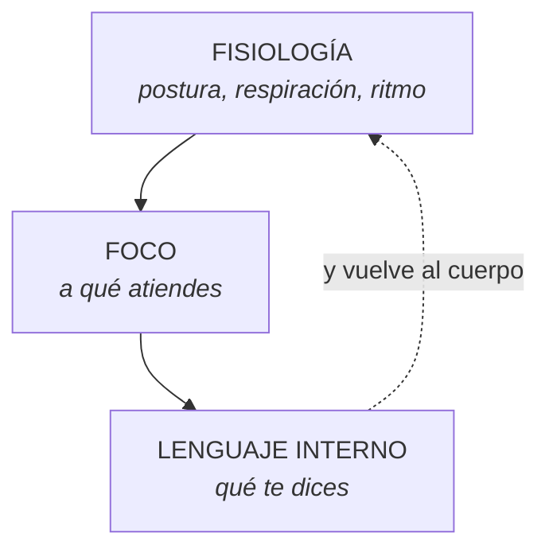

## El triángulo del estado

Cambia uno y los otros dos se mueven. El cuerpo es el único que responde de
inmediato.

## Las cuatro palancas

| Palanca | Qué hacer | Cuánto tarda |
|---|---|---|
| Respiración | Exhalar más largo que inhalar, seis ciclos | 30 s |
| Postura | Espalda apoyada, pecho abierto, hombros abajo | Inmediato |
| Ritmo | Bajar la velocidad al hablar y al moverse | 15 s |
| Mirada | Soltar el punto de foco y abrir la visión periférica | Inmediato |

## Cambio de estado en 60 segundos

Para usar antes de una conversación difícil, una reunión o una sesión:

1. **Pies en el suelo**, peso repartido.
2. **Tres exhalaciones largas**, más largas que la inhalación.
3. **Suelta la mandíbula** — sepárala apenas, la lengua abajo.
4. **Abre la mirada**: deja de fijar un punto, nota los bordes de tu campo
   visual sin mover los ojos.
5. **Una frase**, la que hayas elegido. Corta y creíble.

## Interpretar vs. observar

| ❌ Interpretación | ✅ Observación |
|---|---|
| «Está enfadada» | «Habla más rápido, no me mira, mandíbula tensa» |
| «Le dio igual» | «Se calló tres segundos y cambió de tema» |
| «Está convencido» | «Se inclinó hacia adelante y asintió dos veces» |
| «Se puso nervioso» | «Empezó a mover el pie y respiró más arriba» |

## Hoja de observación

Elige a una persona con la que hables a menudo.

**Su línea base** (cómo está cuando está tranquila):

| Canal | Cómo es normalmente |
|---|---|
| Respiración (dónde, qué ritmo) | |
| Postura | |
| Voz (ritmo, tono) | |
| Cara (mandíbula, mirada) | |

**Los cambios** (qué se movió, y justo después de qué):

| Qué dije o pasó | Qué cambió en ella | Mi hipótesis | ¿Lo comprobé? |
|---|---|---|---|
| | | | |
| | | | |
| | | | |

## Las tres reglas

1. **Línea base primero.** Sin ella, un gesto no significa nada.
2. **Importa el cambio, no el gesto.** Qué se movió y cuándo.
3. **Siempre comprobar.** *«Te noté distinta cuando salió ese tema, ¿me
   equivoco?»*

## Lo que no hay que hacer

- ❌ Deducir mentiras de un gesto. No hay ningún gesto que indique mentira.
- ❌ Repetir que «el 93 % de la comunicación es no verbal». Es una mala lectura
  de un estudio de 1967 que su propio autor lleva décadas corrigiendo.
- ❌ Decirle a alguien lo que siente. Preguntar, siempre.
