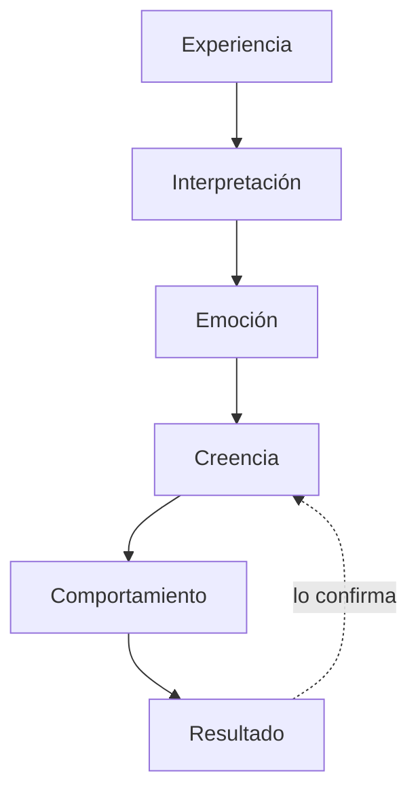

## La programación mental

Gran parte de nuestras creencias, hábitos y respuestas automáticas se desarrollan
a través de **experiencias repetidas**.

El proceso general es este:

Y aquí está lo importante: **el resultado alimenta de vuelta la creencia**. El
circuito se cierra sobre sí mismo y se confirma solo.

### Un ejemplo completo

**Experiencia:** a los ocho años, la niña lee en voz alta en clase y se
equivoca. Los compañeros se ríen.

**Interpretación:** *"me equivoqué y me humillaron"*.

**Emoción:** vergüenza. Intensa, física, memorable.

**Creencia:** *"cuando hablo en público hago el ridículo"*.

**Comportamiento:** durante veinte años evita exponerse. Y cuando no puede
evitarlo, va tensa, con la voz temblorosa.

**Resultado:** le sale mal. La creencia queda confirmada.

Nadie diseñó eso. Se instaló solo, en un minuto, cuando tenía ocho años. Y lleva
dos décadas funcionando.

### Dónde puede intervenirse

Fíjate bien en el diagrama: **la experiencia no se puede cambiar**. Ya pasó.

Lo que sí se puede cambiar es la **interpretación** — y con ella, todo lo que
viene después.

Ese es exactamente el trabajo de la hipnosis y de la PNL. No borrar el recuerdo:
cambiar el significado que se le dio, y con eso la emoción que dispara.

## El poder del lenguaje

Las palabras que utilizamos tienen un impacto importante sobre nuestra
experiencia interna. No son etiquetas de la realidad: son **instrucciones** para
la mente.

### Lenguaje limitante

- No puedo.
- Es imposible.
- Siempre me equivoco.
- Nunca tengo suerte.

### Lenguaje potenciador

- Estoy aprendiendo.
- Puedo mejorar.
- Buscaré nuevas opciones.
- Cada experiencia me enseña algo.

El lenguaje influye en nuestra percepción, nuestras emociones y nuestro
comportamiento.

### Por qué esto no es "pensamiento positivo"

Hay una diferencia grande, y conviene decirla claro.

El pensamiento positivo dice: *"soy exitoso y capaz"* cuando la persona no se lo
cree. El resultado es que el factor crítico lo rechaza y la frase no entra —a
veces incluso refuerza lo contrario, porque cada repetición recuerda que no es
verdad.

El lenguaje potenciador de la PNL no afirma lo que no es. **Abre posibilidad**:

| En vez de | Que no se cree | Mejor |
|---|---|---|
| "Soy exitoso" | Suena falso | "Estoy construyendo lo que quiero" |
| "No tengo miedo" | Lo tiene | "Puedo hacerlo aunque tenga miedo" |
| "Soy capaz" | Lo duda | "Estoy aprendiendo a hacerlo" |

La segunda columna no miente y la mente la acepta. Por eso funciona.

### Las tres palabras que más pesan

Presta atención a estas tres en tu diálogo interno de esta semana:

- **"Siempre"** y **"nunca"** — generalizaciones que convierten un hecho en ley.
- **"Tengo que"** — obligación sin elección. Prueba a cambiarla por "elijo" y
  fíjate en lo que cambia en el cuerpo.
- **"Es que yo soy…"** — identidad. Lo más difícil de mover, porque no describe
  lo que haces sino lo que crees ser.

## Aplicaciones de la hipnosis y la PNL

Podemos utilizar estos principios para:

✅ Fortalecer la confianza.
✅ Mejorar la comunicación.
✅ Transformar creencias limitantes.
✅ Incrementar la motivación.
✅ Desarrollar nuevos hábitos.
✅ Gestionar mejor las emociones.
✅ Potenciar el aprendizaje.

## Reflexión final

> ¿Qué ideas has aceptado sobre ti mismo que hoy podrían estar limitando tu
> crecimiento?
>
> ¿Y qué ocurriría si comenzaras a construir nuevas formas de pensar, sentir y
> actuar?

Seguimos creciendo juntos, líderes. 🤝✨
