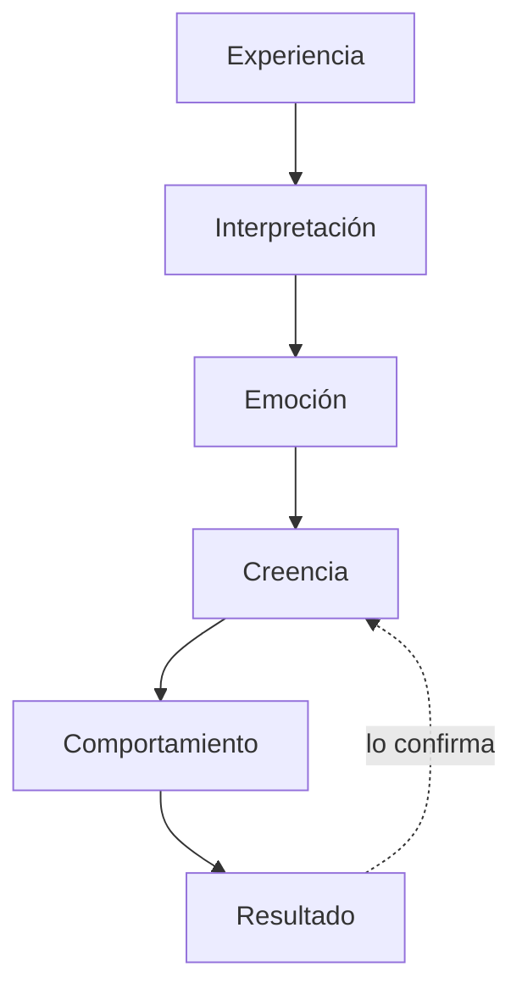

## Mitos y realidades

| El mito dice | La realidad es |
|---|---|
| Es perder el control | La persona permanece consciente |
| Es dormir | La atención está **más** enfocada, no menos |
| Permite controlar a alguien | Conserva su capacidad de decisión |
| Solo algunos pueden | Casi todos entramos en trance a diario |

## Registro de trances naturales

Anota tres momentos de esta semana en los que te descubras en trance natural:

| Momento | ¿Qué estaba haciendo? | ¿Cuánto duró? |
|---|---|---|
| 1 | | |
| 2 | | |
| 3 | | |

Pistas: manejar y llegar sin recordar el trayecto, meterte en una serie o un
libro, trabajar tan concentrado que no oíste que te hablaban, recordar algo con
tanto detalle que sentiste la emoción de nuevo.

## El circuito de la programación mental

**La experiencia no se puede cambiar. La interpretación sí** — y con ella todo
lo que viene después.

## Completa tu circuito

Elige una creencia que reconozcas como limitante:

| Paso | Tu respuesta |
|---|---|
| **Experiencia** — ¿cuándo la sentí por primera vez? | |
| **Interpretación** — ¿qué me dije de mí? | |
| **Emoción** — ¿qué sentí? | |
| **Creencia** — ¿en qué frase se convirtió? | |
| **Comportamiento** — ¿qué hago hoy por eso? | |
| **Resultado** — ¿qué obtengo y cómo lo confirma? | |

Cuando el circuito está escrito completo, deja de ser *«yo soy así»*. Se ve como
lo que es: una secuencia que empezó en algún lugar. Y todo lo que empezó puede
modificarse.

## Tu mensaje nuevo

Formula uno que cumpla tres condiciones: **en positivo**, **en presente o en
proceso** y **creíble para ti hoy**.

| En vez de | Que no te crees | Mejor |
|---|---|---|
| "Soy exitoso" | Suena falso | "Estoy construyendo lo que quiero" |
| "No tengo miedo" | Lo tienes | "Puedo hacerlo aunque tenga miedo" |

**Mi mensaje nuevo:** ______________________________

Escríbelo en una tarjeta y déjala donde la veas al despertar.
