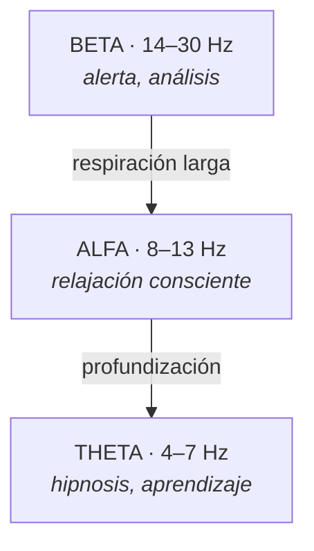

## 🔵 Estado BETA (14 a 30 Hz)

**Estado de alerta y actividad consciente.**

### Características

- Pensamiento lógico
- Análisis
- Planeación
- Concentración
- Resolución de problemas

### Ejemplos

Cuando trabajamos, estudiamos, conducimos o tomamos decisiones.

### Respiración Beta

- Más rápida
- Más superficial
- Predomina en momentos de actividad o estrés

**Observa esto:** cuando estás preocupado o resolviendo un problema, tu
respiración se vuelve corta y alta, en el pecho. Casi nadie lo nota. Empieza a
notarlo.

### El detalle importante

Beta no es malo. Es el estado donde se hace la vida. El problema es **vivir
permanentemente en Beta alto**: ahí es donde aparecen el insomnio, la ansiedad y
la sensación de no poder apagar la cabeza.

---

## 🟢 Estado ALFA (8 a 13 Hz)

**Estado de relajación consciente.**

### Características

- Calma mental
- Mayor creatividad
- Imaginación activa
- Aprendizaje más receptivo

### Ejemplos

Cuando escuchamos música relajante, observamos un paisaje, hacemos una
meditación ligera, o en esos minutos justo después de una ducha caliente.

### Respiración Alfa

- Más lenta
- Más profunda
- Más consciente

### Práctica breve

Respira profundamente durante **30 segundos**, ahora mismo, y observa qué cambia
en tu cuerpo. Los hombros. La mandíbula. El ritmo del pensamiento.

Eso que acabas de hacer es entrar en Alfa a voluntad.

### El detalle importante

Alfa es la **puerta**. Es donde empieza el acceso al inconsciente, y es el
estado donde más se aprende: por eso estudiar tenso rinde tan poco.

---

## 🟣 Estado THETA (4 a 7 Hz)

**Estado de hipnosis ligera a profunda y aprendizaje profundo.**

### Características

- Alta receptividad
- Visualización intensa
- Mayor conexión emocional
- Acceso a recuerdos y recursos internos
- Profundo enfoque interno

### Ejemplos

- Los instantes antes de dormir.
- Los instantes al despertar, antes de abrir los ojos del todo.
- Visualizaciones profundas.
- Procesos hipnóticos.

### Respiración Theta

- Profunda
- Lenta
- Rítmica
- Sensación de tranquilidad y desconexión parcial del entorno

### Aplicaciones

✅ Hipnosis
✅ PNL
✅ Reprogramación mental
✅ Visualización creativa

### El detalle importante

**La mayoría del trabajo de hipnosis y cambio interno ocurre en este estado**,
porque el factor crítico —el filtro de la mente consciente— disminuye su
actividad y la persona se vuelve más receptiva a nuevas asociaciones y
aprendizajes.

Los momentos justo antes de dormir y justo al despertar son Theta natural. Por
eso lo que pienses ahí pesa más de lo que crees. Y por eso revisar el celular en
esos dos momentos es una de las peores costumbres de nuestra época: estás
metiendo contenido ajeno en la ventana más receptiva de tu día.

---

## ⚫ Estado DELTA (0.5 a 3 Hz)

**Estado de sueño profundo.**

### Características

- Descanso físico profundo
- Recuperación y regeneración celular
- Baja actividad consciente

### Respiración Delta

- Muy lenta
- Automática
- Profundamente relajada

Se presenta principalmente durante el sueño profundo. No es un estado en el que
se trabaje: es donde el cuerpo se repara.

---

## Cómo funciona una inducción

Durante una inducción hipnótica la persona suele pasar progresivamente por:

A medida que el cuerpo se relaja:

- Disminuye el diálogo interno
- Disminuye la tensión muscular
- Aumenta la concentración
- Se facilita el aprendizaje

Por esta razón la hipnosis se utiliza para fortalecer recursos, hábitos y
estados emocionales positivos.

## Tabla resumen

| Estado | Hz | Cuándo | Respiración |
|---|---|---|---|
| Beta | 14–30 | Trabajo, análisis, estrés | Rápida y superficial |
| Alfa | 8–13 | Relajación consciente | Lenta y profunda |
| Theta | 4–7 | Antes de dormir, hipnosis | Profunda, lenta, rítmica |
| Delta | 0.5–3 | Sueño profundo | Muy lenta, automática |

## Para practicar hoy

Tres veces en el día, para un minuto y pregúntate: **¿en qué estado estoy?**

Después respira treinta segundos y vuelve a preguntarte.

Con eso ya estás haciendo el trabajo.
