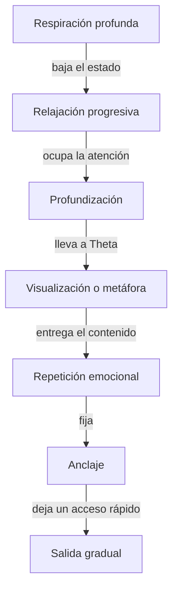

## Las siete vías

Todas comparten un principio: **no discuten con el factor crítico, lo rodean**.

### ✅ 1. Respiración profunda

La puerta más simple y la más subestimada. Cambia el estado fisiológico en
segundos y con él baja el ruido del diálogo interno.

Es siempre el primer paso de cualquier inducción, y funciona por sí sola.

### ✅ 2. Relajación progresiva

Recorrer el cuerpo por partes, soltando cada zona. Frente, ojos, mandíbula,
cuello, hombros, brazos, pecho, abdomen, piernas, pies.

Tiene un efecto doble: relaja de verdad, y mantiene la atención ocupada en el
cuerpo, lo que reduce el pensamiento analítico.

### ✅ 3. Visualización guiada

El inconsciente no distingue con claridad entre una experiencia vivida y una
imaginada **con suficiente detalle sensorial**. Por eso una película te hace
llorar aunque sepas que son actores.

Visualizar con imagen, sonido y sensación crea una experiencia interna que el
sistema registra como propia.

### ✅ 4. Metáforas e historias

La especialidad de Erickson. Una historia no afirma nada sobre ti, así que el
filtro la deja pasar: es "solo un cuento". Pero el inconsciente extrae la
estructura y la aplica.

Por eso las parábolas, los cuentos infantiles y las películas moldean creencias
mucho más que los consejos directos.

### ✅ 5. Repetición emocional

La repetición sola no basta: la repetición **con carga emocional**, sí. Lo que
se repite sintiendo se graba; lo que se repite en automático se olvida.

Esta es la razón por la que un evento único e intenso puede instalar una
creencia para toda la vida, y mil repeticiones tibias no instalan nada.

### ✅ 6. Anclajes

Asociar un estado emocional a un estímulo concreto —un gesto, una palabra, una
presión con los dedos— de modo que después ese estímulo pueda evocar el estado.

Es el mismo mecanismo por el que una canción te devuelve a un momento exacto de
tu vida. La diferencia es que aquí se hace a propósito.

*(El curso de Emociones y anclajes lo trabaja completo.)*

### ✅ 7. Hipnosis ericksoniana

El lenguaje indirecto: sugerencias abiertas, permisivas, que no ordenan sino que
proponen.

En vez de *"vas a relajarte"*, Erickson decía cosas como *"puedes empezar a
notar de qué manera tu cuerpo va soltando… a su propio ritmo"*.

Es imposible resistirse a algo que no te están ordenando. Ahí está toda la
elegancia del método.

---

## Cómo se combinan en la práctica

Una sesión típica no usa una sola vía: las encadena.

Esa es exactamente la estructura de la inducción que vamos a trabajar en el
módulo 5.

## Lo que ninguna de estas vías hace

Ninguna instala algo que la persona rechace en sus valores profundos. El
factor crítico se relaja, no desaparece.

Si una sugerencia va contra algo esencial para la persona, el sistema la
descarta o simplemente sale del trance. Eso es una protección, y funciona.

## Práctica antes de seguir

Vas a hacer tu primera visualización completa en el ejercicio de este módulo.
No la saltes: el módulo 5 asume que ya la hiciste.
