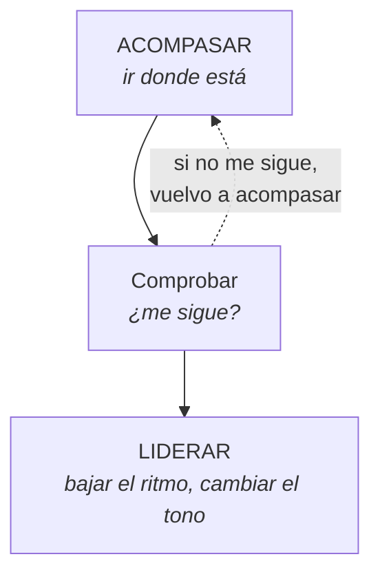

## Qué es el rapport

La sensación de estar con alguien que está en el mismo sitio que tú. No es
simpatía ni es dar la razón: es que **el otro te reconoce como alguien seguro**.

Cuando existe, se puede decir casi cualquier cosa. Cuando no, hasta un «¿todo
bien?» suena a interrogatorio.

Y esto no es una teoría de la PNL: es la observación de que las personas bajan
la guardia con quien perciben parecido. La PNL solo describió cómo se produce
ese parecido a propósito.

---

## Lo que NO es rapport

**No es imitar gestos.** La caricatura de la PNL —cruzas las piernas, yo cruzo
las piernas— es exactamente lo que rompe el rapport cuando se nota. Y con la
pareja se nota siempre.

**No es dar la razón.** Se puede estar en total desacuerdo con alguien y
sostener la sintonía.

**No es hablar suave.** Con alguien enfadado, hablar demasiado suave demasiado
pronto se percibe como condescendencia.

---

## Los cuatro canales

### 1 · Cuerpo

Postura general, orientación, nivel de tensión. No gestos concretos: **el tono
general**.

Si tu pareja está hundida en el sofá y tú le hablas de pie desde la puerta, hay
una diferencia de altura y de postura que ya está diciendo algo antes de la
primera palabra. Sentarse cambia la conversación más que elegir mejor las
palabras.

### 2 · Ritmo

La velocidad al hablar y al moverse. Es el canal **más potente y el más
ignorado**.

Alguien acelerado y alguien pausado no se entienden aunque digan lo mismo: el
pausado percibe agresión y el acelerado percibe desinterés.

### 3 · Palabras

Usar **sus** palabras, no las tuyas traducidas. Si dice «me siento sola», no
respondas «entiendo que te sientas desatendida». Has cambiado su palabra por la
tuya, y eso se nota como corrección.

Aquí entra también el canal preferente —visual, auditivo, kinestésico— que se
trabaja en el módulo 2.

### 4 · Estado

El más importante y el que casi nadie nombra. Si el otro está en un estado
intenso y tú estás plano, no hay sintonía posible: siente que no te importa.

No significa alterarse igual. Significa **no estar en un planeta distinto**.

---

## Acompasar y liderar

La secuencia completa. Es lo más útil del módulo.

**Acompasar** es ir donde está el otro: si habla rápido y alto, no le respondas
en susurros. Baja un poco respecto a él, no mucho.

**Comprobar** es el paso que se salta: hacer un cambio pequeño y ver si viene
detrás. Si no viene, todavía no toca liderar.

**Liderar** es bajar tú y que el otro baje contigo. Funciona **solo si hubo
acompasamiento primero**. Intentar liderar de entrada —«tranquilízate»— es la
forma más rápida de subir una discusión.

### El ejemplo

Tu pareja llega alterada y habla rápido.

> ❌ *«A ver, tranquilízate y cuéntame despacio.»* → escalada.
>
> ✅ Responder con energía parecida —«a ver, cuéntame, ¿qué pasó?»— y después,
> frase a frase, ir bajando el ritmo. En dos o tres turnos el otro baja detrás,
> casi siempre sin darse cuenta.

---

## Lo que rompe el rapport en dos segundos

| Lo que hace | Por qué rompe |
|---|---|
| Mirar el móvil | Dice que hay algo más importante |
| «Ya, pero…» | Anula todo lo anterior |
| Terminarle las frases | Le quita el turno y el ritmo |
| Contar tu caso parecido | Le quitas el tema |
| Corregir un dato menor | Convierte el tema en un juicio |
| Solucionar antes de tiempo | Se lee como «no quiero escuchar esto» |

La última es la más frecuente en pareja, y casi siempre viene de buena
intención: uno quiere resolver, el otro quería ser escuchado. **Y hay una
pregunta que lo arregla:** *«¿quieres que te ayude a resolverlo o quieres que te
escuche?»*

Hecha en serio, y respetando la respuesta.

---

## El rapport de largo plazo

En una pareja de años el rapport no se juega en una conversación: se juega en la
acumulación.

Gottman lo midió con un concepto muy concreto, los **intentos de conexión**: los
pequeños gestos de «mírame» a lo largo del día —un comentario sobre algo que
pasa, una foto que enseña, una pregunta sin importancia—. Lo que decide no es la
gran conversación: es cuántos de esos se responden.

Las parejas que duran responden a la mayoría. Las que se rompen dejan pasar casi
todos.

> El rapport no se construye en la conversación difícil. Se gasta ahí lo que se
> ahorró antes.
