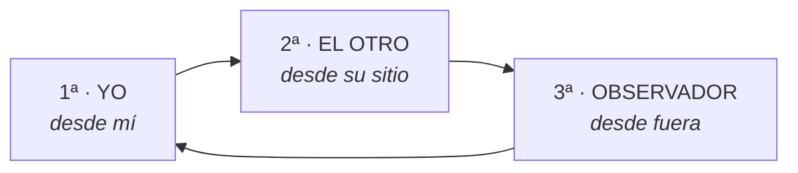

## Las tres

| Posición | Desde dónde | Qué aporta | Su exceso |
|---|---|---|---|
| **Primera** | Desde ti | Claridad sobre lo que necesitas | Egocentrismo: solo importa lo mío |
| **Segunda** | Desde el otro | Comprensión real | Anularse: siempre entiendo al otro y nunca a mí |
| **Tercera** | Desde fuera | Perspectiva y salida | Frialdad: analizar en vez de estar |

Una relación sana se mueve entre las tres. Los problemas aparecen cuando alguien
**vive instalado en una**.

Y merece la pena decirlo: mucha gente que llega a este curso vive en segunda
posición. Entiende siempre al otro, se pone siempre en su lugar, y no sabe qué
necesita. Para esa persona, el ejercicio verdaderamente difícil es la **primera**.

---

## El recorrido

Se hace de pie, con tres sitios físicos. **Moverse importa**: el cuerpo ayuda a
cambiar de estado, y hacerlo sentada en la misma silla no produce el mismo
efecto.

### Preparación

Elige una situación concreta, de intensidad media. Marca tres puntos en el
suelo.

### 1ª posición · desde ti

Ponte en tu sitio. Revive la escena **desde tus ojos**.

- ¿Qué ves desde aquí?
- ¿Qué sientes, y dónde?
- ¿Qué necesitabas en ese momento?
- ¿Qué querías que pasara?

Anota antes de moverte.

### Rompe

Sal de los tres puntos. Mira alrededor, cuenta al revés. Es necesario: sin
romper, te llevas tu estado a la posición del otro y el ejercicio no sirve.

### 2ª posición · desde el otro

Ponte en su sitio. **Adopta su postura** —cómo estaba de verdad— y habla en
primera persona **como si fueras esa persona**:

- «Yo, [su nombre], en esta situación estoy…»
- ¿Qué veo desde aquí, mirando a la otra persona?
- ¿Qué estoy sintiendo?
- ¿Qué necesito?
- ¿Qué estoy intentando conseguir con lo que hago?

Hablar en primera persona es lo que hace la diferencia. «Ella probablemente se
sentía…» es análisis. «Yo me siento…» es otra cosa.

### Rompe otra vez

Imprescindible. No se sale de la segunda posición sin romper.

### 3ª posición · desde fuera

Ponte en el tercer punto, **de lado**, viendo a los dos. Alguien que os quiere a
los dos y no toma partido.

- ¿Qué veo pasar entre estas dos personas?
- ¿Qué está haciendo cada una?
- ¿Qué necesita cada una?
- ¿Qué le diría a la primera? ¿Y a la segunda?
- ¿Qué es lo que ninguna de las dos está viendo?

La última pregunta es la que da el hallazgo.

### Volver

Regresa a tu sitio **llevándote lo que aprendiste**. Y una última pregunta:

> **¿Qué voy a hacer distinto la próxima vez?**

Sin esa pregunta, el ejercicio es interesante y no sirve de nada.

---

## Los dos errores

**1 · Quedarse en la segunda.** Entender tanto al otro que se pierde el propio
sitio. Se sale del ejercicio pensando «pobre, con lo que está pasando» y sin
haber recuperado lo que uno necesitaba. La primera posición no es egoísmo: es
información.

**2 · Usar la tercera para tener razón mejor.** Ponerse de observador y concluir
que, visto desde fuera, uno tenía razón. Si la tercera posición confirma
exactamente lo que pensabas al principio, no estuviste en la tercera: estuviste
en la primera de pie en otro sitio.

**Señal de que salió bien:** algo te sorprendió. Si no hay sorpresa, no hubo
cambio de posición.

---

## Cuándo NO ponerse en el lugar del otro

- **Con maltrato.** Entender al que hace daño es un mecanismo clásico de
  permanencia. Ahí la técnica está contraindicada.
- **Cuando no puedes sostener la primera.** Si no tienes claro qué necesitas, la
  segunda posición te va a barrer. Primero la primera, cuantas veces haga falta.
- **Muy pronto.** Con la herida abierta, ponerse en el lugar del otro se siente
  —y funciona— como quitarse la razón a uno mismo.

> Si al terminar no te sorprendió nada, no cambiaste de posición: solo cambiaste
> de silla.
