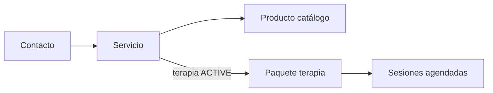
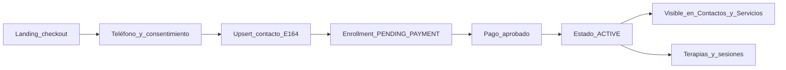

# Guía de uso — CRM Dayana Beltrán PNL

Flujo de ejemplo para operar el sistema de punta a punta. Login: `/admin/sign-in` con el usuario OWNER del seed.

En el panel lateral, el bloque **«Cómo usar el CRM»** resume el mismo flujo sin salir de la app.

## Modelo de datos (Enrollment)

| Concepto | Qué es |
|----------|--------|
| **Contacto** | Persona (teléfono E.164). Siempre es el primer paso. |
| **Producto** | Catálogo en `/admin/products` (terapia, curso, taller). |
| **Servicio (Enrollment)** | Contrato del contacto con un producto. Estados: Lead → Pago pendiente → **Activo** → Completado. |
| **TherapyPackage** | Contenedor operativo (sesiones, Meet, notas). **Solo** cuando una terapia pasa a **Activo**. |
| **Terapias** (`/admin/therapies`) | Vista operativa: terapias activas o por activar (Lead). Los Lead no aparecen en la pestaña principal hasta activarlos. |

## 1. Entrada al panel

1. Abre **https://tu-dominio.com/admin/sign-in** e inicia sesión.
2. Pulsa el **logo «Dayana Beltrán PNL»** en la barra lateral para volver al **dashboard** (`/admin`).
3. El menú lateral lista todas las secciones con el mismo espaciado (sin botón «Inicio» aparte).

## 2. Día típico — cliente nuevo que paga en la web

1. **Web pública** — El cliente elige un plan en `#servicios`. Antes de PayPal o Mercado Pago debe indicar **teléfono** (obligatorio) y aceptar el tratamiento de datos; el nombre y correo son opcionales.
2. **Vinculación automática** — El servidor hace upsert del contacto por teléfono E.164 (si ya existe, se reutiliza; si no, se crea). El enrollment y el pago quedan ligados a ese contacto desde el inicio.
3. **Contactos** (`/admin/contacts`) — Aparece el contacto con teléfono real. Ábrelo y revisa pestañas **Resumen**, **Servicios**, **Pagos**.
4. **Servicios** (`/admin/services`) — Verifica el enrollment (`PENDING_PAYMENT` → `ACTIVE` tras pago). Pagos legacy sin identificar: filtro **Sin identificar** o aviso en el dashboard.
5. **Pagos** (`/admin/payments`) — Confirma el pago aprobado; enlaces a contacto y servicio.
6. **Página de éxito** (`/pago/exito`) — Si el contacto ya está vinculado, solo muestra confirmación y WhatsApp; opcionalmente pide correo si falta. Pagos antiguos con placeholder pueden pedir teléfono para vincular manualmente.
7. **Terapias** (`/admin/therapies`) — Si es terapia 1:1, aparece en la lista con próxima sesión.
8. **Detalle del servicio** (`/admin/enrollments/[id]`) — Agendar sesiones, Meet, cuaderno clínico, marcar completada o no-show.
9. **WhatsApp** — Botón **Abrir chat** en cada contacto (enlace directo). **Mensajes rápidos**: copiar texto y pegarlo tú misma en WhatsApp.

## 3. Cliente manual (sin pago web)

1. **Contactos** → **Nuevo contacto** (nombre, teléfono internacional, origen, zona horaria).
2. Tras crear, el asistente pregunta **¿Agregar servicio?** — elige producto y opcionalmente **Activar ya** (terapia → crea `TherapyPackage` y aparece en Terapias).
3. Si omites el servicio: ficha del contacto → pestaña **Servicios** → **Nuevo servicio**.
4. En el detalle del enrollment → **Registrar pago manual** si cobró por fuera.
5. Cambia estado a **Activo** cuando corresponda (solo **una terapia ACTIVE** por contacto). Al activar una terapia se crea el paquete de sesiones automáticamente.

## 4. Catálogo y web pública

1. **Productos** (`/admin/products`) — Crear, editar precio USD, desactivar/eliminar. Solo **OWNER**.
2. Los cambios actualizan la sección **Terapias / Cursos** de la landing y los montos del checkout (vía base de datos).
3. **Talleres** (`/admin/workshops`) — Ediciones con fechas y cupos (tarjetas de talleres en la web si están cableadas a DB).

## 5. Comunicación

1. **Mensajes rápidos** (`/admin/messages`) — Textos para copiar; variables `{{first_name}}`, `{{product_title}}` (OWNER).
2. Desde **Contactos** → ficha del cliente → pestaña **Servicios** (vincular producto) y panel de mensajes rápidos en **Resumen**.

## 6. Equipo y auditoría

1. **Staff** (`/admin/team`) — Alta de operadores (OWNER).
2. **Auditoría** (`/admin/audit`) — Historial de cambios del staff (OWNER).
3. Rol **READONLY** — Puede ver; botones de escritura deshabilitados en la UI.

## 7. Notificaciones (correo, SMS, WhatsApp API)

1. Configura variables según `docs/notifications-setup.md` (Gmail/Resend, Twilio, Meta WhatsApp).
2. **Talleres** → icono megáfono → campaña a todos los contactos (plantilla `workshop_open`).
3. Tras un **pago aprobado**, el cliente recibe correo de confirmación (estética de marca) si tiene email.
4. Historial en **Notificaciones** (`/admin/notifications`).

## 8. Automatización Inngest (opcional)

Configura Inngest según `docs/inngest-setup.md` para campañas grandes, cron de recordatorios y confirmación post-pago.

## Checklist rápido

| Tarea | Dónde |
|--------|--------|
| Ver terapias activas y próxima sesión | Terapias |
| Ficha completa del cliente | Contactos → detalle |
| Cambiar pipeline lead → activo | Servicios o detalle enrollment |
| Agendar / reprogramar sesión | Detalle enrollment (terapia) |
| Cobro manual | Detalle enrollment → pagos |
| Cambiar precio en la web | Productos |
| Copiar mensaje y abrir WhatsApp | Ficha contacto · Mensajes rápidos |
