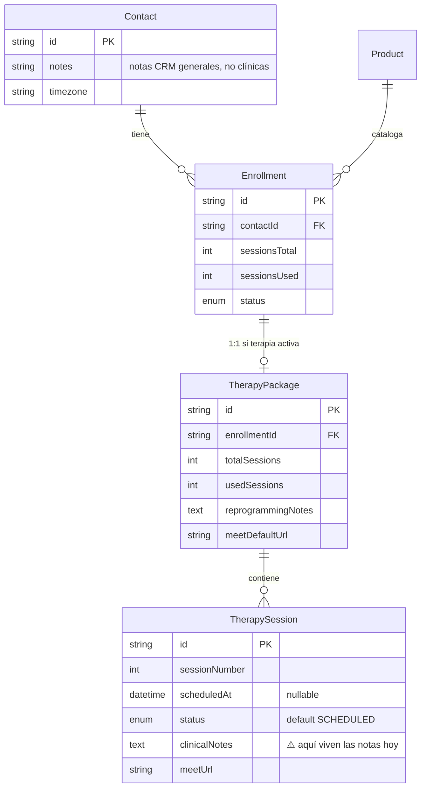
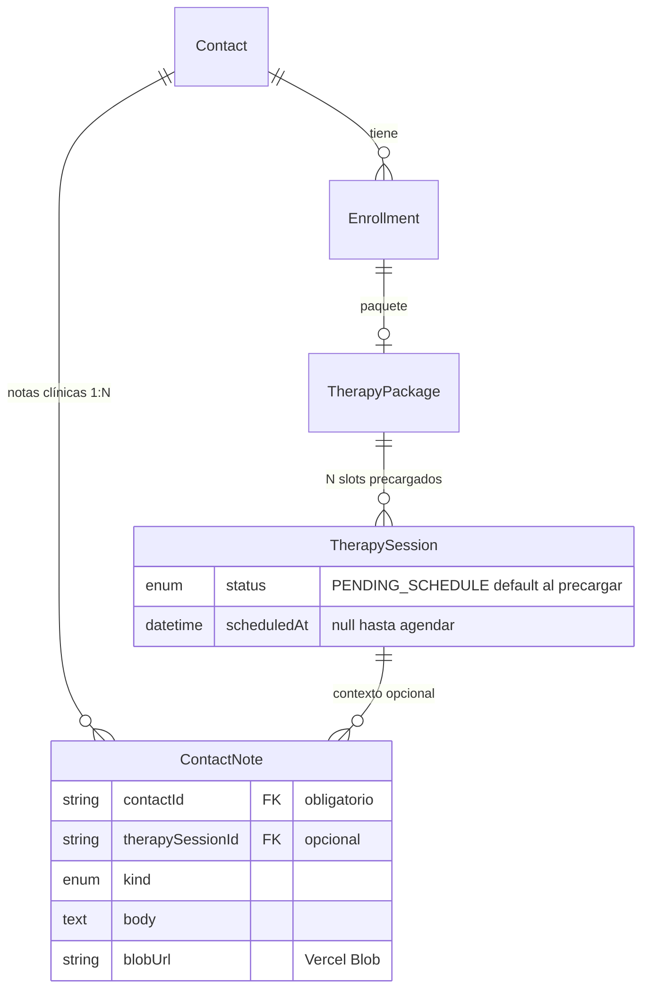
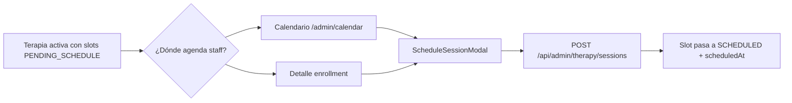

# Plan de implementación — Terapias, calendario interno y notas clínicas

> Documento de planificación. **No implementar** hasta aprobación explícita de cada fase.
> Generado: 2026-06-06

---

## 1. Resumen ejecutivo

El CRM ya gestiona terapias 1:1 con `TherapyPackage` + `TherapySession`, agendamiento manual en el detalle del enrollment y notas clínicas **por sesión** (`TherapySession.clinicalNotes`). Las decisiones acordadas son:

1. **Notas clínicas ligadas al contacto** (no al enrollment ni a la sesión como entidad primaria), con referencia opcional a `therapySessionId` solo como contexto.
2. **Calendario interno** (sin Google Calendar): vista semana/mes, agendamiento desde calendario o desde enrollment, un solo flujo.
3. **Slots precargados** al activar terapia: crear sesiones 1..N en estado `PENDING_SCHEDULE` (sin fecha).
4. **Notas manuscritas** vía área de texto amplia + subida PDF/imagen a **Vercel Blob** (canvas con stylus fuera de alcance inicial).
5. **Rendimiento**: índices, paginación, lazy load de adjuntos, CDN de Blob.
6. **UX**: eliminar hints duplicados de agendamiento; centralizar guía operativa.

**Prisma hoy:** esquema válido; **1 migración pendiente** en la base Neon (`20260605120000_crm_perf_indexes`). No hay infraestructura de Blob ni página de calendario.

**Esfuerzo estimado:** 4–6 fases ordenadas, ~2–3 semanas de desarrollo incremental con verificación manual entre fases.

---

## 2. Estado actual

### 2.1 Modelo de datos (hoy)



### 2.2 Flujo operativo actual

| Paso | Dónde | Comportamiento |
|------|-------|----------------|
| Crear servicio terapia | Ficha contacto → Servicios | `Enrollment` en `LEAD`; sin `TherapyPackage` |
| Activar terapia | Detalle enrollment o pago | `ensureTherapyPackage()` crea **solo** el paquete (cabecera), **no** las N sesiones |
| Agendar sesión | `EnrollmentDetailClient` | `scheduleTherapySession()` hace **upsert** por `sessionNumber`; crea fila al primer agendamiento |
| Notas clínicas | Tabla de sesiones en enrollment | `textarea` por fila → `PATCH /api/admin/therapy/sessions` |
| Lista terapias | `/admin/therapies` | Muestra próxima sesión `SCHEDULED`; hint «Activa el servicio…» en leads |
| Recordatorios | Inngest cron | Busca `status: SCHEDULED` + `scheduledAt` en ventana 24h |

### 2.3 Archivos clave existentes

| Área | Rutas |
|------|-------|
| Schema | `prisma/schema.prisma` |
| Lógica terapia | `lib/crm/therapy.ts`, `lib/crm/enrollments.ts` |
| UI enrollment | `app/components/admin/EnrollmentDetailClient.tsx` |
| UI lista terapias | `app/components/admin/crm/TherapiesPageClient.tsx` |
| Ficha contacto | `app/components/admin/ContactDetailClient.tsx` |
| API sesiones | `app/api/admin/therapy/sessions/route.ts` |
| API paquete | `app/api/admin/therapy/package/route.ts` |
| Permisos notas | `lib/crm/staff.ts` → `canEditClinicalNotes` |
| Recordatorios | `lib/inngest/functions.ts` → `sessionReminderFn` |

### 2.4 Hints duplicados (UX)

| Ubicación | Mensaje |
|-----------|---------|
| `ContactDetailClient` → `ServiceFlowGuide` | «Terapias activas → agendar sesiones» |
| `TherapiesPageClient` | «Activa el servicio para agendar sesiones en Terapias» |
| `CrmGuidePanel` (sidebar) | Flujo completo incluyendo Terapias → agendar |
| `docs/crm-guia-uso.md` | Misma narrativa |

**Problema:** tres superficies repiten el flujo de agendamiento; el enrollment detail tiene su propio bloque «Agendar sesión» separado de cualquier vista calendario (inexistente).

### 2.5 Infraestructura de archivos

- **No** hay `@vercel/blob` en `package.json`.
- **No** hay rutas API de upload.
- `.env.example` no documenta `BLOB_READ_WRITE_TOKEN`.
- `Contact.notes` es texto libre CRM; **no** sustituye notas clínicas estructuradas.

### 2.6 Uso de `clinicalNotes` y `reprogrammingNotes`

| Campo | Ubicaciones |
|-------|-------------|
| `TherapySession.clinicalNotes` | `schema.prisma`, `lib/crm/therapy.ts` (`completeTherapySession`, `updateTherapySession`), `app/api/admin/therapy/sessions/route.ts`, `EnrollmentDetailClient.tsx`, `enrollments/[id]/page.tsx` |
| `TherapyPackage.reprogrammingNotes` | `schema.prisma`, `lib/crm/therapy.ts`, `app/api/admin/therapy/package/route.ts`, `EnrollmentDetailClient.tsx` |

`reprogrammingNotes` es operativa (reprogramación del paquete), **no clínica** — puede permanecer en `TherapyPackage` o migrarse a notas de contacto tipo `OPERATIONAL`; se recomienda **dejarla en paquete** por ahora.

---

## 3. Modelo objetivo

### 3.1 Nueva entidad: `ContactNote`

Notas clínicas y manuscritas pertenecen al **contacto**. La sesión es contexto opcional.

```prisma
enum ContactNoteKind {
  TEXT           // nota escrita en CRM
  HANDWRITTEN    // adjunto imagen/PDF (cuaderno/tablet)
  // STYLUS_CANVAS  // fase futura
}

model ContactNote {
  id               String          @id @default(cuid())
  contactId        String          @map("contact_id")
  kind             ContactNoteKind @default(TEXT)
  body             String?         @db.Text      // texto libre o transcripción
  therapySessionId String?         @map("therapy_session_id")  // contexto opcional
  enrollmentId     String?         @map("enrollment_id")       // contexto opcional
  // Adjunto Blob (solo HANDWRITTEN)
  blobUrl          String?         @map("blob_url")
  blobPath         String?         @map("blob_path")
  mimeType         String?         @map("mime_type")
  fileSizeBytes    Int?            @map("file_size_bytes")
  fileName         String?         @map("file_name")
  staffUserId      String?         @map("staff_user_id")
  createdAt        DateTime        @default(now()) @map("created_at")
  updatedAt        DateTime        @updatedAt @map("updated_at")

  contact        Contact         @relation(...)
  therapySession TherapySession? @relation(...)
  enrollment     Enrollment?     @relation(...)
  staffUser      StaffUser?      @relation(...)

  @@index([contactId, createdAt(sort: Desc)])
  @@index([therapySessionId])
  @@map("contact_notes")
}
```

**Relación principal:** `Contact` 1:N `ContactNote`.

**Reglas de negocio:**
- Toda nota clínica **debe** tener `contactId`.
- `therapySessionId` y `enrollmentId` son opcionales; al crear nota desde una sesión completada, rellenar ambos.
- `Contact.notes` sigue siendo nota administrativa general (no clínica).
- Permisos: reutilizar `canEditClinicalNotes` (OWNER, OPERATOR); READONLY solo lectura.

### 3.2 Cambios en `TherapySession`

```prisma
enum TherapySessionStatus {
  PENDING_SCHEDULE  // nuevo: slot creado, sin fecha
  SCHEDULED
  COMPLETED
  NO_SHOW
  CANCELLED
  RESCHEDULED
}

model TherapySession {
  // ...
  clinicalNotes String? @map("clinical_notes")  // DEPRECAR → eliminar en fase 2
  contactNotes  ContactNote[]                 // relación inversa opcional
}
```

### 3.3 Diagrama objetivo



---

## 4. Migración de datos

### 4.1 Estrategia para `clinicalNotes` existentes

**Fase A — Expandir (sin romper UI actual):**
1. Crear tabla `contact_notes` y enum `ContactNoteKind`.
2. Script SQL en migración:

```sql
INSERT INTO contact_notes (
  id, contact_id, kind, body, therapy_session_id, enrollment_id, created_at, updated_at
)
SELECT
  gen_random_uuid()::text,  -- o cuid vía script TS post-migrate
  e.contact_id,
  'TEXT',
  ts.clinical_notes,
  ts.id,
  e.id,
  ts.updated_at,
  ts.updated_at
FROM therapy_sessions ts
JOIN therapy_packages tp ON tp.id = ts.therapy_package_id
JOIN enrollments e ON e.id = tp.enrollment_id
WHERE ts.clinical_notes IS NOT NULL AND trim(ts.clinical_notes) <> '';
```

> Nota: Prisma usa `cuid()` — preferir script `prisma/seed-migrate-notes.ts` ejecutado una vez tras `migrate deploy` para IDs consistentes, o función SQL si se acepta uuid.

**Fase B — Dual-write temporal (1 sprint):**
- Al guardar notas desde UI antigua, escribir en `ContactNote` **y** mantener `clinicalNotes` sincronizado (o viceversa).
- Tests manuales comparando conteos.

**Fase C — Contracción:**
- Eliminar columna `clinical_notes` de `therapy_sessions`.
- Eliminar referencias en API y componentes.

### 4.2 Sesiones existentes sin precarga

Tras añadir `PENDING_SCHEDULE`:
- Sesiones ya creadas con `scheduledAt = null` y sin completar → migrar a `PENDING_SCHEDULE`.
- Sesiones `SCHEDULED` con fecha → sin cambio.
- Sesiones `COMPLETED` / `NO_SHOW` → sin cambio.
- Paquetes activos **sin ninguna fila en `therapy_sessions`** → backfill: crear 1..`totalSessions` como `PENDING_SCHEDULE` (solo las que no existan por `session_number`).

### 4.3 Rollback

- Mantener backup de `clinical_notes` en columna hasta validar Fase C.
- Export CSV de `contact_notes` antes de drop.

---

## 5. Calendario interno

### 5.1 Alcance

- Vista **semana** (primaria) y **mes** (secundaria).
- Solo sesiones de terapia (`TherapySession` con `scheduledAt` no nulo y status `SCHEDULED` o `RESCHEDULED`).
- Sin integración Google Calendar (fuera de alcance).

### 5.2 Rutas y archivos nuevos

| Tipo | Ruta propuesta |
|------|----------------|
| Página | `app/admin/(panel)/calendar/page.tsx` |
| Cliente | `app/components/admin/crm/CalendarPageClient.tsx` |
| Vista semana | `app/components/admin/crm/calendar/WeekView.tsx` |
| Vista mes | `app/components/admin/crm/calendar/MonthView.tsx` |
| Modal agendar | `app/components/admin/crm/calendar/ScheduleSessionModal.tsx` (reutilizable desde enrollment) |
| Query lib | `lib/crm/calendar-sessions.ts` |
| API | `app/api/admin/calendar/sessions/route.ts` |
| Menú | `app/config/crm-menu-items.ts` → ítem «Calendario» en sección Clientes |

### 5.3 API `GET /api/admin/calendar/sessions`

**Query params:**
- `from` (ISO UTC, inclusive)
- `to` (ISO UTC, exclusive)
- `status` opcional (default: `SCHEDULED,RESCHEDULED`)

**Respuesta (por evento):**
```ts
{
  id: string;
  sessionNumber: number;
  scheduledAt: string;       // UTC ISO
  durationMinutes: number;
  status: TherapySessionStatus;
  meetUrl: string | null;
  contact: { id, firstName, lastName, phoneE164, timezone };
  enrollmentId: string;
  therapyPackageId: string;
  productTitle: string;
}
```

**Índice existente:** `therapy_sessions_scheduled_at_idx` — suficiente para rango; considerar índice compuesto `(status, scheduled_at)` en migración de calendario.

### 5.4 API mutaciones (reutilizar + extender)

- **Agendar / reprogramar:** extender `POST/PATCH /api/admin/therapy/sessions` — misma lógica, mismo audit log.
- Desde calendario: abrir `ScheduleSessionModal` con slot precargado (`therapyPackageId`, `sessionNumber`, contacto).
- **Drag-and-drop** (fase posterior): `PATCH` con nuevo `scheduledAt`.

### 5.5 Manejo de timezone

| Capa | Regla |
|------|-------|
| Persistencia | Siempre **UTC** en `scheduledAt` (ya así) |
| Display calendario | Eje horario fijo **America/Bogota** (zona operativa Dayana) con etiqueta en UI |
| Display por evento | Tooltip secundario en `contact.timezone` del paciente |
| Inputs `datetime-local` | Seguir patrón `toLocalInput()` de `EnrollmentDetailClient` usando `contact.timezone` |
| API | Sin conversión; cliente envía ISO UTC |

### 5.6 Flujo único de agendamiento



**UX:** eliminar bloque redundante de hints; el enrollment detail conserva tabla de sesiones + botón «Agendar» que abre el **mismo modal** que el calendario.

---

## 6. Slots precargados

### 6.1 Cambio en `ensureTherapyPackage`

Hoy (`lib/crm/therapy.ts`):

```ts
// Solo crea TherapyPackage; sesiones se crean lazy en scheduleTherapySession
return prisma.therapyPackage.create({ data: { enrollmentId, totalSessions, usedSessions: 0 } });
```

**Objetivo:**

```ts
// Pseudocódigo
const pkg = await prisma.therapyPackage.create({ ... });
await prisma.therapySession.createMany({
  data: Array.from({ length: totalSessions }, (_, i) => ({
    therapyPackageId: pkg.id,
    sessionNumber: i + 1,
    status: TherapySessionStatus.PENDING_SCHEDULE,
    durationMinutes: 60,
  })),
  skipDuplicates: true,
});
```

### 6.2 Cambio en `scheduleTherapySession`

- Dejar de depender del **upsert create** para nuevas filas.
- **Update** del slot `PENDING_SCHEDULE` (o `RESCHEDULED`) existente:
  - `scheduledAt`, `meetUrl`, `status: SCHEDULED`.
- Validar que `sessionNumber <= totalSessions` y que el slot no esté `COMPLETED`.

### 6.3 UI enrollment

- Tabla muestra **todas** las N filas desde activación (incluso sin fecha).
- Columna fecha: «Pendiente de agendar» si `PENDING_SCHEDULE`.
- Selector de sesión en agendar: solo slots `PENDING_SCHEDULE` o reprogramables.

### 6.4 Inngest

- `sessionReminderFn`: mantener filtro `status: SCHEDULED` **y** `scheduledAt IS NOT NULL` — los slots `PENDING_SCHEDULE` no disparan recordatorios.

### 6.5 Criterios de aceptación

- [ ] Al activar terapia de 6 sesiones existen 6 filas `therapy_sessions`.
- [ ] `usedSessions` sigue incrementando solo en `completeTherapySession`.
- [ ] Lista `/admin/therapies` muestra próxima sesión `SCHEDULED` (ignora `PENDING_SCHEDULE`).

---

## 7. Notas manuscritas

### 7.1 Dependencias nuevas

```bash
bun add @vercel/blob
```

Variables (añadir a `.env.example`):

```
BLOB_READ_WRITE_TOKEN=
```

### 7.2 API upload

| Método | Ruta | Descripción |
|--------|------|-------------|
| POST | `/api/admin/contacts/[id]/notes/upload` | Recibe `FormData` con `file`; valida mime (`image/jpeg`, `image/png`, `image/webp`, `application/pdf`); límite 15 MB; `put()` a path `contacts/{contactId}/notes/{noteId}/{filename}` |
| POST | `/api/admin/contacts/[id]/notes` | Crea `ContactNote` TEXT o HANDWRITTEN (con metadata blob) |
| GET | `/api/admin/contacts/[id]/notes?cursor=&limit=20` | Lista paginada, sin cargar binarios |
| PATCH | `/api/admin/contacts/[id]/notes/[noteId]` | Edita `body` (texto) |
| DELETE | `/api/admin/contacts/[id]/notes/[noteId]` | Borra nota + `del()` blob si aplica |

Seguridad: `requireWriteStaff` + `canEditClinicalNotes` para mutaciones.

### 7.3 UI — panel en ficha contacto

| Archivo | Descripción |
|---------|-------------|
| `app/components/admin/crm/ContactNotesPanel.tsx` | Lista + lazy load |
| `app/components/admin/crm/ContactNoteEditor.tsx` | Textarea grande (min-height 240px) |
| `app/components/admin/crm/ContactNoteUpload.tsx` | Dropzone PDF/imagen |

**Ubicación:** nueva pestaña **«Notas clínicas»** en `ContactDetailClient` (junto a Resumen / Servicios / Pagos).

**Lazy load:**
- Lista: título, fecha, kind, snippet de `body` (100 chars).
- Adjunto: thumbnail / icono PDF; `blobUrl` solo al expandir o abrir modal.
- Paginación cursor-based (`createdAt` + `id`).

### 7.4 Integración con sesiones

- Al **completar sesión** en enrollment: prompt opcional «Añadir nota clínica» → crea `ContactNote` con `therapySessionId` prellenado (no escribir en sesión).
- Histórico por contacto agrupa notas de todos los enrollments.

### 7.5 Fuera de alcance inmediato

- Canvas stylus in-browser.
- Sync live reMarkable.
- OCR de manuscritos.

---

## 8. Rendimiento

### 8.1 Índices (existentes + propuestos)

| Índice | Estado | Uso |
|--------|--------|-----|
| `therapy_sessions_scheduled_at_idx` | ✅ existe | Calendario rango fechas |
| `therapy_sessions(status, scheduled_at)` | 🔲 proponer | Filtro calendario |
| `contact_notes(contact_id, created_at DESC)` | 🔲 nuevo | Lista ficha contacto |
| `contact_notes(therapy_session_id)` | 🔲 nuevo | Notas por sesión |
| `enrollments_updated_at_idx` | ⏳ migración pendiente | Lista terapias |
| `contacts_consent_marketing_at_idx` | ⏳ migración pendiente | Campañas |

### 8.2 Paginación

- Notas: `take: 20`, cursor `createdAt_id`.
- Calendario: cargar solo rango visible (semana ≈ 7 días, mes ≈ 42 celdas); no cargar todo el histórico.

### 8.3 Blob / CDN

- URLs públicas de Vercel Blob con cache CDN por defecto.
- No almacenar binarios en PostgreSQL.
- Generar URLs firmadas solo si se requiere privacidad extra (evaluar en fase 2; inicialmente token server-side + URLs no listadas).

### 8.4 Frontend

- `dynamic()` import de `WeekView` / `MonthView`.
- Virtualizar lista de notas si > 50 entradas (fase posterior).
- Debounce 500ms en autosave de notas texto.

### 8.5 Queries a optimizar

- `listActiveTherapies`: ya limita `sessions` a 1 `SCHEDULED`; tras precarga, filtrar `where: { status: SCHEDULED, scheduledAt: { not: null } }` (ya implícito).
- Calendario: una sola query con `include` acotado (contact select mínimo).

---

## 9. Fases de implementación

### Fase 0 — Prisma y base (bloqueante)

**Archivos:** `prisma/migrations/`, `package.json` (sin cambios de deps aún)

| Tarea | Detalle |
|-------|---------|
| Aplicar migración pendiente | `bun run db:migrate:deploy` o `prisma migrate dev` en dev |
| Validar | `bunx prisma validate` |

**Criterios:**
- [ ] `prisma migrate status` → «Database schema is up to date»
- [ ] App arranca sin error de índices faltantes

---

### Fase 1 — Modelo `ContactNote` + `PENDING_SCHEDULE`

**Archivos:**
- `prisma/schema.prisma`
- `prisma/migrations/20260606120000_contact_notes_and_pending_schedule/migration.sql`
- `prisma/scripts/migrate-clinical-notes.ts` (one-off)
- `lib/crm/contact-notes.ts` (nuevo)
- `app/api/admin/contacts/[id]/notes/route.ts` (nuevo)

**Criterios:**
- [ ] Tabla `contact_notes` creada
- [ ] Enum `PENDING_SCHEDULE` disponible
- [ ] Datos históricos de `clinical_notes` migrados a `contact_notes`
- [ ] Tests manuales: conteo pre/post migración

---

### Fase 2 — Slots precargados + refactor `therapy.ts`

**Archivos:**
- `lib/crm/therapy.ts` — `ensureTherapyPackage`, `scheduleTherapySession`
- `lib/crm/enrollments.ts` — sin cambios de contrato (ya llama `ensureTherapyPackage`)
- `prisma/scripts/backfill-pending-slots.ts`

**Criterios:**
- [ ] Nuevo paquete activo → N sesiones `PENDING_SCHEDULE`
- [ ] Agendar actualiza slot existente
- [ ] Paquetes legacy backfilled

---

### Fase 3 — UI notas en contacto + deprecar notas en sesión

**Archivos:**
- `app/components/admin/ContactDetailClient.tsx` — pestaña Notas
- `app/components/admin/crm/ContactNotesPanel.tsx` (nuevo)
- `app/components/admin/EnrollmentDetailClient.tsx` — quitar columna notas; link «Ver notas del contacto»
- `app/api/admin/therapy/sessions/route.ts` — quitar `clinicalNotes` de PATCH/complete
- `lib/crm/therapy.ts` — `completeTherapySession` crea `ContactNote` opcional

**Criterios:**
- [ ] Notas visibles y editables solo en ficha contacto
- [ ] Completar sesión puede adjuntar nota vinculada
- [ ] READONLY no edita

---

### Fase 4 — Vercel Blob upload

**Archivos:**
- `package.json` — `@vercel/blob`
- `.env.example` — `BLOB_READ_WRITE_TOKEN`
- `app/api/admin/contacts/[id]/notes/upload/route.ts`
- `app/components/admin/crm/ContactNoteUpload.tsx`
- `docs/db-setup.md` — sección Blob

**Criterios:**
- [ ] Subir PDF e imagen ≤ 15 MB
- [ ] Archivo visible en panel con lazy load
- [ ] Borrar nota elimina blob

---

### Fase 5 — Calendario interno

**Archivos:**
- `app/admin/(panel)/calendar/page.tsx`
- `app/components/admin/crm/CalendarPageClient.tsx`
- `app/components/admin/crm/calendar/*`
- `lib/crm/calendar-sessions.ts`
- `app/api/admin/calendar/sessions/route.ts`
- `app/config/crm-menu-items.ts`
- `app/components/admin/crm/ScheduleSessionModal.tsx` (compartido con enrollment)

**Criterios:**
- [ ] Vista semana muestra sesiones del rango
- [ ] Vista mes navegable
- [ ] Agendar desde calendario y desde enrollment usa mismo modal
- [ ] Timezone America/Bogota en eje; tooltip timezone contacto

---

### Fase 6 — UX cleanup + documentación

**Archivos:**
- `ContactDetailClient.tsx` — simplificar `ServiceFlowGuide` (quitar paso agendar → apuntar a Calendario)
- `TherapiesPageClient.tsx` — un solo hint en leads
- `CrmGuidePanel.tsx` — añadir Calendario al flujo
- `docs/crm-guia-uso.md`, `docs/data-model.md`

**Criterios:**
- [ ] Un solo lugar describe el flujo de agendamiento (sidebar guía + doc)
- [ ] Sin mensajes contradictorios entre contacto / terapias / enrollment

---

### Fase 7 — Contracción schema (opcional, post-validación)

- Migración: `ALTER TABLE therapy_sessions DROP COLUMN clinical_notes`
- Eliminar tipos/refs muertos

---

## 10. Prisma — hallazgos y acciones

### 10.1 `bunx prisma validate`

```
✅ The schema at prisma/schema.prisma is valid
⚠️  package.json#prisma deprecated (Prisma 7 → prisma.config.ts)
```

### 10.2 `bunx prisma migrate status`

```
Datasource: PostgreSQL (Neon) — neondb
5 migrations found
❌ Pending: 20260605120000_crm_perf_indexes
```

**Contenido migración pendiente:**
- `contacts_consent_marketing_at_idx`
- `products_kind_idx`
- `enrollments_updated_at_idx`
- `payments_status_paid_at_idx`
- `contact_tags_tag_id_idx`

### 10.3 Schema vs migraciones

| Verificación | Resultado |
|--------------|-----------|
| `therapy_packages` / `therapy_sessions` en init | ✅ alineado con schema |
| `TherapySessionStatus` valores | ✅ coincide (falta `PENDING_SCHEDULE` — nuevo) |
| `clinical_notes` en DB | ✅ existe; a eliminar en fase 7 |
| Drift schema/migrations | ❌ no detectado por validate |

### 10.4 Migraciones a crear (planificadas)

1. **Inmediata (operaciones):** aplicar `20260605120000_crm_perf_indexes`
2. **`20260606120000_contact_notes_and_pending_schedule`:**
   - Enum `ContactNoteKind`
   - Enum value `PENDING_SCHEDULE`
   - Tabla `contact_notes` + FKs + índices
   - Índice `(status, scheduled_at)` en `therapy_sessions`
3. **`20260607120000_drop_session_clinical_notes`:** (fase 7) drop columna

### 10.5 Acciones recomendadas antes de código

```bash
# En entorno con DATABASE_URL configurado
bun run db:migrate:deploy
bunx prisma migrate status
```

No se requiere fix de una línea en schema actual; el bloqueo es **migración no aplicada en Neon**.

---

## 11. Fuera de alcance

| Item | Motivo |
|------|--------|
| Google Calendar / CalDAV | Decisión explícita: calendario interno only |
| Sync live reMarkable | Complejidad; upload manual suficiente v1 |
| Canvas stylus en browser | Fase futura opcional |
| OCR manuscritos | No requerido |
| Notificaciones push de calendario | Inngest recordatorio 24h ya cubre |
| Multi-terapeuta / salas | Modelo actual es 1 operadora |

---

## 12. Checklist de verificación manual

### Base de datos
- [ ] `prisma migrate status` sin pendientes
- [ ] Activar terapia 6 sesiones → 6 slots `PENDING_SCHEDULE`
- [ ] Migración `clinical_notes` → `contact_notes` con conteo correcto

### Notas clínicas
- [ ] Crear nota texto en ficha contacto
- [ ] Subir PDF e imagen; preview lazy load
- [ ] Nota vinculada a sesión aparece con contexto (nº sesión, producto)
- [ ] READONLY: solo lectura
- [ ] OPERATOR/OWNER: crear, editar, borrar

### Agendamiento
- [ ] Agendar desde calendario (semana)
- [ ] Agendar desde detalle enrollment (mismo modal)
- [ ] Reprogramar cambia `scheduledAt` sin duplicar filas
- [ ] Completar sesión incrementa `usedSessions`
- [ ] No-show no incrementa usadas
- [ ] Recordatorio Inngest solo para `SCHEDULED` con fecha

### Calendario
- [ ] Vista semana navega adelante/atrás
- [ ] Vista mes muestra conteo/dots por día
- [ ] Horas en America/Bogota
- [ ] Tooltip con timezone del contacto

### UX
- [ ] Sin hints duplicados de «agendar en Terapias»
- [ ] Flujo lead → activar → calendario claro en guía sidebar

### Rendimiento
- [ ] Calendario carga < 500 ms en semana típica (dev)
- [ ] Lista notas paginada; no carga todos los blobs al abrir ficha

---

## Apéndice A — Tres decisiones arquitectónicas clave

1. **`ContactNote` con `contactId` obligatorio** — Las notas clínicas son atributo del paciente, no del contrato ni del slot; `therapySessionId` es metadata opcional para contexto histórico.

2. **Slots `PENDING_SCHEDULE` precargados** — Separar «cupos del paquete» de «citas agendadas» simplifica calendario, progreso visual y evita upserts implícitos.

3. **Calendario como capa de lectura/acción sobre la misma API de sesiones** — No duplicar modelo de eventos; `ScheduleSessionModal` compartido garantiza un solo flujo de agendamiento.

---

## Apéndice B — Referencia rápida de comandos

```bash
bunx prisma validate
bunx prisma migrate status
bun run db:migrate:deploy    # producción / Neon
bun run db:migrate           # desarrollo (crea migraciones nuevas)
bun run db:studio            # inspección visual
```

---

## Implementación (2026-06-06)

**Estado:** Fases 1–6 implementadas en código. Migraciones aplicadas en Neon.

### Completado

- [x] Modelo `ContactNote` + enum `PENDING_SCHEDULE` + índices
- [x] Migraciones `20260606120000_*` y `20260606120001_*` aplicadas
- [x] Scripts: `migrate-clinical-notes.ts`, `backfill-pending-slots.ts`, `migrate-pending-schedule-status.ts`
- [x] API notas: GET/POST `/api/admin/contacts/[id]/notes`, PATCH/DELETE `[noteId]`, POST upload
- [x] API calendario: GET `/api/admin/calendar/sessions?from=&to=`
- [x] `ensureTherapyPackage` precarga N slots `PENDING_SCHEDULE`
- [x] `scheduleTherapySession` actualiza slot existente (no upsert-create)
- [x] Pestaña **Notas** en ficha contacto + panel upload PDF/imagen
- [x] Página `/admin/calendar` con vista mes (`react-calendar`) y semana/bloques (`react-big-calendar`)
- [x] `ScheduleSessionModal` compartido con enrollment detail
- [x] UX: guía sidebar → Calendario; hints duplicados reducidos
- [x] `reprogrammingNotes` como textarea en enrollment detail
- [x] `@vercel/blob` + `BLOB_READ_WRITE_TOKEN` en `.env.example`
- [x] `bunx tsc --noEmit` — OK

### Pendiente manual / fase 7

- [ ] Configurar `BLOB_READ_WRITE_TOKEN` en `.env` para uploads en dev/prod
- [ ] Ejecutar `migrate-clinical-notes.ts` si hay datos legacy con `clinical_notes`
- [ ] Fase 7 opcional: `DROP COLUMN clinical_notes` tras validación
- [ ] Verificación manual según checklist §12

### Librerías calendario

- **react-calendar** — vista mes + lista de eventos del día (patrón `EventCalendar` de school-management)
- **react-big-calendar** + **date-fns** — vista semana/día con bloques horarios (patrón `BigCalendar`, sin moment)
